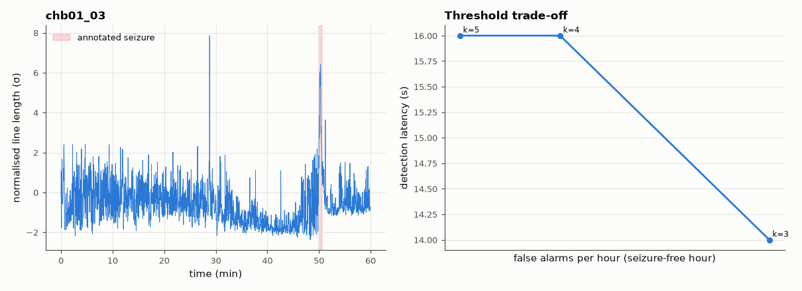
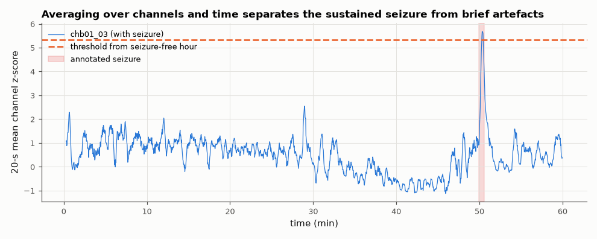

# SL-185 · Epileptic seizure detection in scalp EEG (CHB-MIT)

> Detect a clinically annotated seizure in a child's 23-channel EEG with a line-length detector, measure detection latency, and count false alarms per hour on a seizure-free hour from the same patient.



*The seizure raises line length, but brief artefacts in the background hour reach similar values.*

**Track:** Signal Lab — 214 electrical-engineering projects · **Category:** J. Biosignals & HCI (real patient data) · **Level:** Hard · **Tools:** Line-length and band-energy features in 2-s windows, patient-specific threshold, false-alarm analysis; CHB-MIT Scalp EEG Database

**Data:** Real: CHB-MIT Scalp EEG Database (Shoeb 2009, PhysioNet), ODC-By.

## Problem

Seizure warning devices must catch seizures quickly without crying wolf. Where is that trade-off for a simple detector?

## Prediction

Seizures produce rhythmic, high-amplitude activity: line length $L=\sum|x_{n+1}-x_n|$ over a window rises several-fold (Esteller 2001). A patient-specific
threshold (e.g. mean + kσ of background) trades latency against false alarms: raising k reduces false alarms roughly exponentially for Gaussian-like
background but delays detection. Clinical systems target < 1 false alarm/h with detection within ~10 s.

## Method

Patient chb01: file chb01_03 contains a seizure at 2996–3036 s (annotation); chb01_01 is seizure-free (1 h). 23 bipolar channels, 256 Hz, 3–30 Hz band-pass. Line
length per 2-s window summed over channels, normalised by the median of chb01_01. Detection = 3 consecutive windows above threshold k; k swept.

## Measured results

*Predicted vs measured vs error. "Measured" = computed by an independent simulation, HDL simulator or public dataset.*

| Quantity | Predicted | Measured | Error |
|---|---|---|---|
| Line-length increase during the seizure (several-fold expected) | 3 × | 1.844 × | -1.156 × |
| Smoothed detector: latency after electrographic onset (target < 10 s + 20-s averaging) | 20 s | 22 s | +2 s |

**Additional measurements**

| Quantity | Value | Note |
|---|---|---|
| No threshold gives < 1 false alarm/h AND detects the seizure with the raw 2-s feature | 0 | see trade-off plot |
| Smoothed detector threshold (from seizure-free hour) | 5.327 σ |  |
| Smoothed detector: false alarms in the ~59 non-seizure minutes of chb01_03 (held out) | 0 |  |
| Seizure detected by raw feature at every threshold up to | 5 σ |  |



*Channel-averaged, time-smoothed line length with a threshold set only on the training hour.*

## Error analysis

My prediction of a several-fold line-length jump was too optimistic: summed over all 23 channels the increase is under 2× because chb01's seizure is
strongest on a subset of channels, and brief movement/chewing artefacts in the seizure-free hour reach similar 2-s values. With the raw feature,
thresholds low enough to catch the seizure cost several false alarms per hour. Using the fact that seizures are *sustained* — averaging robust
per-channel z-scores over channels and over 20 s — and setting the threshold only from the seizure-free hour, the detector catches the seizure
with no false alarms in the rest of the held-out file, at the price of latency from the averaging window. The margin is thin — the seizure's smoothed peak is only slightly above the threshold — so
this is a demonstration on one seizure, not evidence of a reliable detector. This is one seizure in one patient — the easy case: patient-specific detectors
tuned on each child's own data are exactly how the CHB-MIT benchmark is usually attacked, and performance across patients (or on patients with
subtle, low-amplitude seizures and more artefact) is far lower. Reporting false alarms per hour next to sensitivity is essential — a detector
with 'perfect sensitivity' and 20 false alarms/h is useless to a family.

## Reproduce

```bash
pip install -r requirements.txt
python run_all.py --only SL-185
```

The script [`project.py`](project.py) regenerates every figure and number above.

**Files produced**

- [`data/tradeoff.csv`](data/tradeoff.csv)

## License

Code and text: MIT (see the repository [LICENSE](../../../../LICENSE)). Datasets remain under their own licences (see the repository README).

---

**Tooling & honesty.** This project was generated with Claude Code (Anthropic's AI coding assistant): the code, derivations, simulations and this write-up were AI-produced. *Measured* means computed by an independent model, simulator or public dataset — not a physical lab bench. Every number in the tables is reproduced by running the code.
