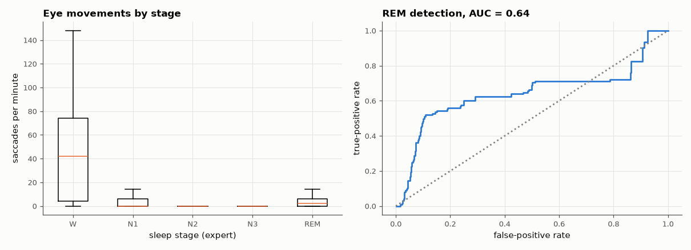

# SL-186 · Eye-movement analysis from the EOG: finding REM sleep

> Detect rapid eye movements in a whole night of horizontal EOG with a velocity-threshold detector and show that they concentrate in REM sleep and wakefulness, as the name 'REM' says — then use the rate alone to spot REM epochs.



*Rapid eye movements are concentrated in REM (and wake), nearly absent in deep sleep.*

**Track:** Signal Lab — 214 electrical-engineering projects · **Category:** J. Biosignals & HCI (real patient data) · **Level:** Moderate · **Tools:** Horizontal EOG, derivative-based saccade detection, per-stage rate statistics; Sleep-EDF Expanded

**Data:** Real: Sleep-EDF Database Expanded (PhysioNet).

## Problem

The electrooculogram measures the eye's corneo-retinal dipole. Can eye movements alone reveal dream sleep?

## Prediction

Horizontal eye rotation changes the EOG by roughly 10–20 µV per degree; saccades are fast (velocity ≫ slow drifts), so a threshold on |dV/dt| detects them.
REM sleep is defined by bursts of such movements; N2/N3 contain almost none (slow rolling movements occur mainly in N1). Expected: REM-epoch saccade
rate ≫ N2/N3 rate, making the rate a useful REM indicator (but also high during wake).

## Method

SC4001 night: EOG horizontal (100 Hz), 0.3–15 Hz band-pass, velocity = derivative smoothed over 30 ms, saccade = |velocity| > 6 × MAD with 200 ms refractory period. Rate per
30-s epoch grouped by the expert's stage; REM detection by rate threshold restricted to sleep epochs (ROC area).

## Measured results

*Predicted vs measured vs error. "Measured" = computed by an independent simulation, HDL simulator or public dataset.*

| Quantity | Predicted | Measured | Error |
|---|---|---|---|
| REM / N2 mean saccade-rate ratio (≫ 1 expected) | 5 × | 5.258 × | +0.2584 × |
| ROC area for REM vs other sleep epochs from saccade rate alone | 0.8 | 0.6439 | -0.1561 |

**Additional measurements**

| Quantity | Value | Note |
|---|---|---|
| Mean saccade rate in W | 43.56 per min | 187 epochs |
| Mean saccade rate in N1 | 6.655 per min | 58 epochs |
| Mean saccade rate in N2 | 0.712 per min | 250 epochs |
| Mean saccade rate in N3 | 1.245 per min | 220 epochs |
| Mean saccade rate in REM | 3.744 per min | 125 epochs |
| Detection threshold (6 × robust σ of velocity) | 1078 µV/s |  |

## Error analysis

A first run used the whole 22-h file, whose daytime wake inflated the robust threshold so that *no* sleep saccades were detected — restricting to the
sleep period (±30 min) fixed it. The velocity detector confirms the core of the definition of REM sleep on real data: saccade rates in REM are about five
times those in N2, as predicted. But the rate alone separates REM from other sleep only modestly (AUC ≈ 0.64, below my 0.8 guess): N1 has *more*
detected movements than REM (slow rolling eye movements and wake intrusions at sleep onset), and much of REM is 'tonic' with no eye movements at
all, so many REM epochs score zero. It is not a complete REM detector — wakefulness also has many saccades (handled by excluding wake epochs here,
in practice by EMG and EEG α), and REM sleep contains tonic periods without eye movements, which limit sensitivity. Gaze-tracking HCI uses the
same signal while awake, with calibration of µV per degree.

## Reproduce

```bash
pip install -r requirements.txt
python run_all.py --only SL-186
```

The script [`project.py`](project.py) regenerates every figure and number above.

## License

Code and text: MIT (see the repository [LICENSE](../../../../LICENSE)). Datasets remain under their own licences (see the repository README).

---

**Tooling & honesty.** This project was generated with Claude Code (Anthropic's AI coding assistant): the code, derivations, simulations and this write-up were AI-produced. *Measured* means computed by an independent model, simulator or public dataset — not a physical lab bench. Every number in the tables is reproduced by running the code.
