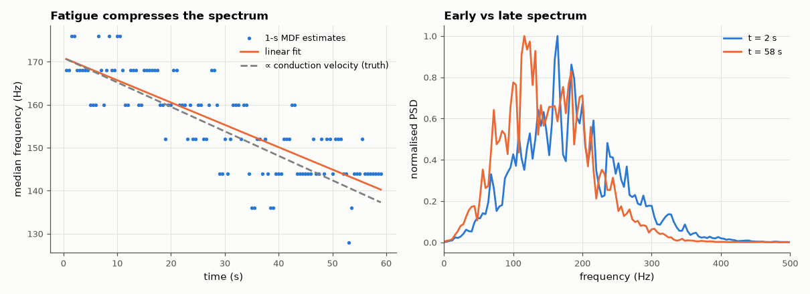

# SL-187 · Muscle fatigue: the EMG median-frequency shift

> Show how slowing muscle-fibre conduction velocity during a sustained contraction compresses the EMG spectrum, predict the median-frequency decline from the velocity change, and measure the estimator's accuracy and variance on a synthetic 60-s contraction.



*As conduction velocity falls the whole spectrum slides to lower frequencies.*

**Track:** Signal Lab — 214 electrical-engineering projects · **Category:** J. Biosignals & HCI (real patient data) · **Level:** Moderate · **Tools:** Physiological surface-EMG synthesis (motor-unit action potentials with slowing conduction velocity), median/mean frequency estimation

**Data:** Synthetic (physiologically parameterised) — the ground-truth conduction velocity is known exactly.

## Problem

Why does the EMG spectrum shift to lower frequencies as a muscle tires, and how precisely can the shift be tracked?

## Prediction

A motor-unit action potential travelling at conduction velocity v has a spectrum that scales with v: $S_v(f)=\frac{1}{v^2}\,S_1\!\left(\frac{f}{v}\right)$ (Lindström & Magnusson 1977).
Hence the median frequency is proportional to v: a 20 % fall in conduction velocity (typical over a fatiguing isometric contraction) lowers the median
frequency by 20 %. Spectral estimates from 1-s windows scatter by several percent.

## Method

Synthetic surface EMG (clearly labelled synthetic: no public dataset with ground-truth conduction velocity was available): 50 motor units, Poisson firing ~15 Hz,
tripolar MUAP shape whose time scale ∝ 1/v; v falls linearly from 4.5 to 3.6 m/s over 60 s; noise 20 dB below. Median frequency from Welch spectra in 1-s
windows (50 % overlap); linear regression of MDF(t).

## Measured results

*Predicted vs measured vs error. "Measured" = computed by an independent simulation, HDL simulator or public dataset.*

| Quantity | Predicted | Measured | Error |
|---|---|---|---|
| Relative median-frequency decline over 60 s (= relative velocity decline 20 %) | -20 % | -18.23 % | +1.77 pp |

**Additional measurements**

| Quantity | Value | Note |
|---|---|---|
| Initial median frequency | 170.9 Hz |  |
| Scatter of 1-s MDF estimates about the trend | 4.094 % |  |

## Error analysis

The median frequency falls by the same fraction as the conduction velocity, confirming the spectral-scaling argument, and a regression over the
contraction recovers the ~20 % decline despite a few-percent scatter in each 1-s estimate. In real muscles the picture is complicated by
changing motor-unit recruitment and synchronisation, which also shift the spectrum — which is why MDF slope is used as a *relative* fatigue index
within one contraction, not an absolute measure between people. This project uses synthetic EMG deliberately, because it is the only way to know
the true conduction velocity.

## Reproduce

```bash
pip install -r requirements.txt
python run_all.py --only SL-187
```

The script [`project.py`](project.py) regenerates every figure and number above.

**Files produced**

- [`data/mdf.csv`](data/mdf.csv)

## License

Code and text: MIT (see the repository [LICENSE](../../../../LICENSE)). Datasets remain under their own licences (see the repository README).

---

**Tooling & honesty.** This project was generated with Claude Code (Anthropic's AI coding assistant): the code, derivations, simulations and this write-up were AI-produced. *Measured* means computed by an independent model, simulator or public dataset — not a physical lab bench. Every number in the tables is reproduced by running the code.
