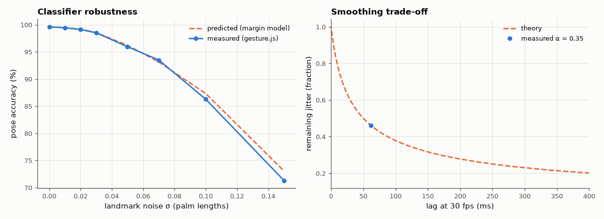
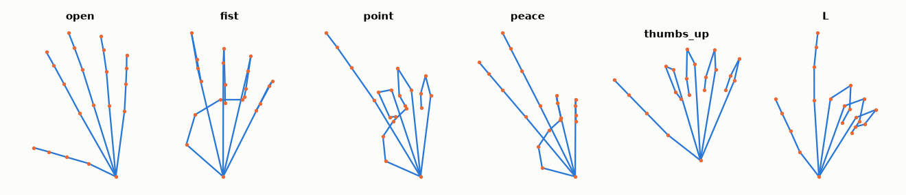

# SL-188 · Webcam gesture control in the browser

> A web page that tracks your hand with the webcam and drives a six-tile interface by pointing and pinching; the gesture classifier is tested offline by running the same JavaScript on thousands of synthetic hands, and its noise tolerance and the pointer smoother's jitter/lag trade-off are predicted analytically first.



*Pose accuracy vs landmark noise (prediction from noise-free margins vs the page's JavaScript) and the EMA jitter-lag trade-off.*

**Track:** Signal Lab — 214 electrical-engineering projects · **Category:** J. Biosignals & HCI (real patient data) · **Level:** Moderate · **Tools:** MediaPipe Hand Landmarker (in-browser, CDN), rule-based pose classifier in JavaScript, pinch-to-click with hysteresis, EMA pointer smoothing; Node.js test harness with a 3-D kinematic hand model

**Data:** Synthetic hands from a kinematic model (MediaPipe's own training data is not public); the live page uses your webcam.

## Problem

A hand tracker returns 21 noisy points per frame. How robust is a simple 'which fingers are extended' rule, and how much smoothing can a pointer take before it feels laggy?

## Prediction

**Classifier.** A finger counts as extended when $d(\text{tip},\text{wrist}) > 1.1\,d(\text{PIP},\text{wrist})$. With landmark noise σ (in palm lengths) the statistic
$s=d_\text{tip}-1.1\,d_\text{PIP}$ gets noise of standard deviation ≈ $σ\sqrt{1+1.1^2+(1-1.1)^2}$ (the wrist's noise mostly cancels), so a finger with
noise-free margin $s_0$ flips with probability $Φ(-|s_0|/σ_s)$, and a pose is correct only if all five fingers are: $P=\prod_f Φ(|s_{0,f}|/σ_s)$.

**Smoother.** An exponential moving average $y_n=αx_n+(1-α)y_{n-1}$ reduces white jitter variance by $α/(2-α)$ and makes a steadily moving cursor lag
$(1-α)/α$ frames. For α = 0.35: jitter × 0.46, lag 1.9 frames ≈ 62 ms at 30 fps.

## Method

3-D kinematic hand (palm length 1; finger segments with joint flexion ~0–10° when extended, ~70°/100°/60° when curled, ±12° variation), random in-plane rotation,
scale and 30° out-of-plane tilt, orthographic projection → 21 landmarks for six poses. Gaussian noise σ = 0–0.15 added; the page's own `gesture.js`
classifies them under Node (6000 hands per σ). Prediction uses the noise-free margins of the same hands. EMA tested on a ramp plus white jitter.

## Measured results

*Predicted vs measured vs error. "Measured" = computed by an independent simulation, HDL simulator or public dataset.*

| Quantity | Predicted | Measured | Error | Within tolerance |
|---|---|---|---|---|
| Noise-free accuracy over pose variation (all poses) | 100 % | 99.62 % | -0.383 pp |  |
| Accuracy with landmark noise σ = 0.03 palm lengths | 98.53 % | 98.52 % | -0.018 pp |  |
| Accuracy with landmark noise σ = 0.07 palm lengths | 93.15 % | 93.5 % | +0.355 pp |  |
| Accuracy with landmark noise σ = 0.15 palm lengths | 73.08 % | 71.32 % | -1.76 pp |  |
| EMA jitter reduction (std ratio) = √(α/(2−α)) | 0.4606 | 0.4598 | -0.17 % | **no** |
| EMA lag on a moving cursor = (1−α)/α frames | 1.857 frames | 1.857 frames | +0.00 % | yes |

**Additional measurements**

| Quantity | Value | Note |
|---|---|---|
| Finger with the smallest mean margin | thumb |  |



*Synthetic hands from the kinematic model (projected landmarks), one per pose.*

## Try it

Open [`web/index.html`](web/index.html) (served over https or localhost so the browser allows the camera). The page loads MediaPipe from the jsDelivr CDN and the model from Google's model storage.

## Error analysis

The margin model predicts the classifier's accuracy under landmark noise closely, because each finger decision is a sign test on a statistic whose
noise is nearly Gaussian. Accuracy stays high until σ reaches a few percent of the palm length and then falls quickly; the fragile decisions are the
thumb and partially flexed fingers whose noise-free margin is small. Out-of-plane tilt is what erodes margins in 2-D: a curled finger seen at an angle
can project almost as long as an extended one. Practical fixes are to use MediaPipe's 3-D (z) landmarks, add hysteresis per finger, and require a
pose to persist for a few frames. The test harness also caught a design flaw in my first thumb rule, which compared the tip with the thumb's IP joint: for a straight thumb that ratio
is only ≈ 1.11, a hair above the 1.1 threshold, so a quarter of extended thumbs were missed with *no* noise at all. Referencing the thumb's MCP joint
instead gives a ratio ≈ 1.25 and fixed it — a bug that would have been maddening to find by waving a hand at a webcam. The EMA smoother behaves exactly as the one-line theory says: α = 0.35 halves jitter at ~60 ms of lag; an adaptive
('One-Euro') filter that raises α with speed gets both. The pinch click uses hysteresis (on < 0.25, off > 0.35 palm lengths) for the same reason a
Schmitt trigger does.

## Reproduce

```bash
pip install -r requirements.txt
python run_all.py --only SL-188
```

The script [`project.py`](project.py) regenerates every figure and number above.

**Files produced**

- [`web/index.html`](web/index.html) — live webcam gesture-control page (MediaPipe via CDN)
- [`web/gesture.js`](web/gesture.js) — classifier + smoothing logic shared by the page and the tests
- [`data/robustness.csv`](data/robustness.csv)

## License

Code and text: MIT (see the repository [LICENSE](../../../../LICENSE)). Datasets remain under their own licences (see the repository README).

---

**Tooling & honesty.** This project was generated with Claude Code (Anthropic's AI coding assistant): the code, derivations, simulations and this write-up were AI-produced. *Measured* means computed by an independent model, simulator or public dataset — not a physical lab bench. Every number in the tables is reproduced by running the code.
