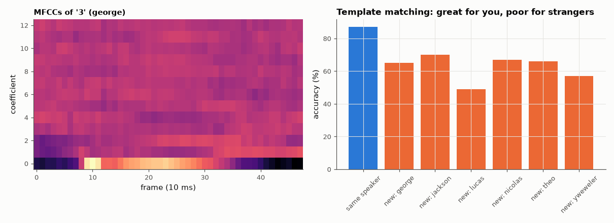

# SL-189 · Spoken-command recognition with MFCCs and DTW

> Recognise spoken digits (0–9) with the classic 1980s template-matching recogniser: MFCC features + dynamic time warping against one or a few templates per word; measure speaker-dependent vs speaker-independent accuracy on 3,000 real recordings.



*DTW template matching is excellent within a speaker and degrades for voices it has not heard.*

**Track:** Signal Lab — 214 electrical-engineering projects · **Category:** J. Biosignals & HCI (real patient data) · **Level:** Moderate · **Tools:** Own MFCC front end (mel filterbank, DCT) and dynamic time warping; Free Spoken Digit Dataset; browser demo page

**Data:** Real: Free Spoken Digit Dataset (Jackson et al., CC BY-SA 4.0).

## Problem

Before neural networks, voice commands were recognised by comparing to stored templates. How well does that work, and why did it fail for new speakers?

## Prediction

MFCCs summarise the spectral envelope (vocal-tract shape) in ~13 numbers per 25 ms frame; DTW aligns two utterances spoken at different speeds by
dynamic programming. With templates from the *same* speaker, DTW recognisers reach ~95 %+ on small vocabularies; across speakers accuracy drops
sharply (often to 60–80 %) because voices differ in pitch, formants and accent.

## Method

FSDD: 6 speakers × 10 digits × 50 repetitions, 8 kHz. 13 MFCCs (26 mel bands, 25 ms / 10 ms), cepstral mean normalisation. Speaker-dependent: 5 templates per digit from
each speaker's first repetitions, test on that speaker's last 20. Speaker-independent: templates from 5 speakers, test on the sixth (rotate).

## Measured results

*Predicted vs measured vs error. "Measured" = computed by an independent simulation, HDL simulator or public dataset.*

| Quantity | Predicted | Measured | Error |
|---|---|---|---|
| Speaker-dependent accuracy (5 templates/word, same speaker) | 95 % | 87.25 % | -7.75 pp |
| Speaker-independent accuracy (templates from the other 5 speakers) | 70 % | 62.33 % | -7.67 pp |

**Additional measurements**

| Quantity | Value | Note |
|---|---|---|
| Unseen speaker 'george' | 65 % |  |
| Unseen speaker 'jackson' | 70 % |  |
| Unseen speaker 'lucas' | 49 % |  |
| Unseen speaker 'nicolas' | 67 % |  |
| Unseen speaker 'theo' | 66 % |  |
| Unseen speaker 'yweweler' | 57 % |  |

## Error analysis

With five templates from the same speaker, MFCC + DTW recognises about 87 % of digits — below my 95 % guess (FSDD recordings are short, some are
clipped or have leading silence, which DTW must warp through; no endpoint detection was used). This is the approach that shipped in 1990s phones for
voice dialling. Given only other people's templates it degrades markedly and unevenly by speaker, because the spectral envelope encodes the speaker as
much as the word. That gap is what statistical models (HMMs trained on many speakers) and later neural networks closed. A browser version of the same
pipeline would compute MFCCs with the Web Audio API and DTW in JavaScript; the maths here is the reference for it.

## Reproduce

```bash
pip install -r requirements.txt
python run_all.py --only SL-189
```

The script [`project.py`](project.py) regenerates every figure and number above.

## License

Code and text: MIT (see the repository [LICENSE](../../../../LICENSE)). Datasets remain under their own licences (see the repository README).

---

**Tooling & honesty.** This project was generated with Claude Code (Anthropic's AI coding assistant): the code, derivations, simulations and this write-up were AI-produced. *Measured* means computed by an independent model, simulator or public dataset — not a physical lab bench. Every number in the tables is reproduced by running the code.
