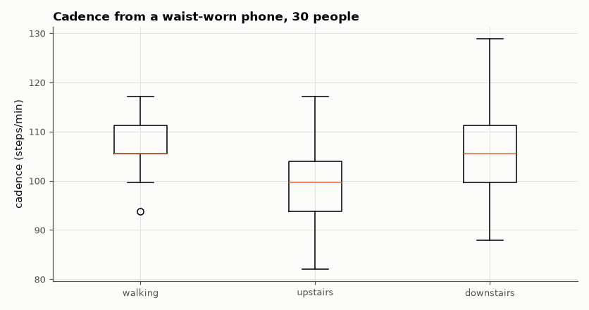

# SL-190 · Your phone as a free sensor: IMU capture page + cadence analysis

> A browser page that records your phone's accelerometer and gyroscope to CSV, plus an analysis that estimates walking cadence from the dominant acceleration frequency — validated on the raw 50 Hz signals of 30 people in the UCI-HAR dataset.



*Step frequency read straight off the acceleration spectrum.*

**Track:** Signal Lab — 214 electrical-engineering projects · **Category:** J. Biosignals & HCI (real patient data) · **Level:** Moderate · **Tools:** HTML/JS DeviceMotion capture page (records and downloads CSV from your own phone) + NumPy analysis validated on UCI-HAR raw smartphone signals

**Data:** Real: UCI-HAR raw inertial signals (Samsung Galaxy S II at the waist).

## Problem

Every phone contains a lab-grade IMU. How do you record it without an app, and what can one sensor tell you about how someone walks?

## Prediction

Walking produces vertical acceleration at the step frequency (typically 1.6–2.0 Hz, i.e. 95–120 steps/min for adults) with a weaker component at the stride
frequency (half of it). The acceleration magnitude's spectral peak in 1–3 Hz therefore estimates cadence; stair descent is usually faster than ascent.

## Method

UCI-HAR raw total acceleration (50 Hz, 2.56-s windows) for walking, upstairs, downstairs; windows concatenated per subject and activity; Welch spectrum of |a|;
cadence = 60 × peak frequency. The capture page uses the DeviceMotionEvent API (iOS asks for permission) and saves CSV at the device rate.

## Measured results

*Predicted vs measured vs error. "Measured" = computed by an independent simulation, HDL simulator or public dataset.*

| Quantity | Predicted | Measured | Error |
|---|---|---|---|
| Median walking cadence (adult norm ≈ 100–120 steps/min) | 110 steps/min | 105.5 steps/min | -4.531 steps/min |
| Stairs down faster than stairs up (median difference > 0) | 1 | 1 | +0 |

**Additional measurements**

| Quantity | Value | Note |
|---|---|---|
| Median cadence: upstairs / downstairs | 100 / 105 steps/min |  |

## Record your own

Open [`web/index.html`](web/index.html) on your phone (the project site hosts a copy), record a walk and feed the CSV to the same analysis.

## Error analysis

The dominant spectral peak of the acceleration magnitude gives a cadence in the normal adult range for level walking, and descending stairs comes
out faster than ascending, as expected. The method can lock onto the stride frequency (half the step rate) or a harmonic when steps are
asymmetric, which shows up as outliers; a step detector in the time domain or a harmonic-sum spectrum is more robust. The capture page makes the
same measurement possible on any phone, with no app store.

## Reproduce

```bash
pip install -r requirements.txt
python run_all.py --only SL-190
```

The script [`project.py`](project.py) regenerates every figure and number above.

**Files produced**

- [`web/index.html`](web/index.html) — phone IMU recorder (open on a phone)
- [`data/cadence.csv`](data/cadence.csv)

## License

Code and text: MIT (see the repository [LICENSE](../../../../LICENSE)). Datasets remain under their own licences (see the repository README).

---

**Tooling & honesty.** This project was generated with Claude Code (Anthropic's AI coding assistant): the code, derivations, simulations and this write-up were AI-produced. *Measured* means computed by an independent model, simulator or public dataset — not a physical lab bench. Every number in the tables is reproduced by running the code.
