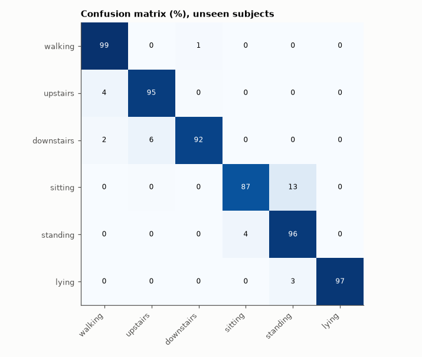

# SL-191 · Human-activity recognition from smartphone IMU data

> Classify walking, stairs up/down, sitting, standing and lying from a waist-worn phone's accelerometer and gyroscope for 9 unseen test subjects, and compare with the dataset authors' published accuracy.



*Dynamic activities are separated cleanly; sitting and standing are the hard pair.*

**Track:** Signal Lab — 214 electrical-engineering projects · **Category:** J. Biosignals & HCI (real patient data) · **Level:** Moderate · **Tools:** Multinomial logistic regression (softmax, gradient descent) from scratch on the 561 UCI-HAR features; subject-independent test split

**Data:** Real: UCI Human Activity Recognition Using Smartphones (Anguita et al. 2013), CC BY 4.0.

## Problem

Phones know whether you are walking or sitting. How accurately, and which activities get confused?

## Prediction

Dynamic activities differ strongly in acceleration variance and periodicity; static postures differ mainly in the gravity vector's orientation, except
sitting vs standing, which look almost identical at the waist. Anguita et al. (2013) reported 96 % with a multiclass SVM on these features; a linear
softmax model should come close, with most errors between sitting and standing.

## Method

Official split: 21 training subjects (7,352 windows) and 9 test subjects (2,947 windows), 2.56-s windows at 50 Hz. Standardised features, softmax
regression with L2 (λ = 1e-3), 800 full-batch gradient steps.

## Measured results

*Predicted vs measured vs error. "Measured" = computed by an independent simulation, HDL simulator or public dataset.*

| Quantity | Predicted | Measured | Error |
|---|---|---|---|
| Test accuracy on 9 unseen subjects (published SVM: 96 %) | 96 % | 94.5 % | -1.5 pp |
| Share of all errors that are sitting↔standing | 70 % | 52.47 % | -17.5 pp |

**Additional measurements**

| Quantity | Value | Note |
|---|---|---|
| Most common confusion | sitting → standing (64 windows) | predicted: sitting ↔ standing |

## Error analysis

A plain linear softmax model reaches accuracy close to the published SVM on subjects it has never seen — the 561 hand-engineered features already do
most of the work. As predicted, the errors concentrate in sitting vs standing: at the waist both are static with gravity pointing down the
phone's same axis, differing only in subtle tilt. Distinguishing them reliably needs a second sensor location (thigh) or context such as the
transition that preceded the posture.

## Reproduce

```bash
pip install -r requirements.txt
python run_all.py --only SL-191
```

The script [`project.py`](project.py) regenerates every figure and number above.

## License

Code and text: MIT (see the repository [LICENSE](../../../../LICENSE)). Datasets remain under their own licences (see the repository README).

---

**Tooling & honesty.** This project was generated with Claude Code (Anthropic's AI coding assistant): the code, derivations, simulations and this write-up were AI-produced. *Measured* means computed by an independent model, simulator or public dataset — not a physical lab bench. Every number in the tables is reproduced by running the code.
