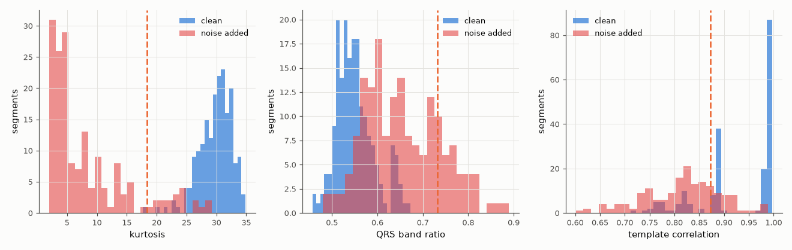

# SL-192 · Automatic ECG signal-quality checker

> Flag unusable 5-second ECG segments automatically using three signal-quality indices, and measure sensitivity and specificity against segments where real electrode-motion noise was deliberately added at known times.



*Each index separates clean from heavily corrupted segments; majority voting combines them.*

**Track:** Signal Lab — 214 electrical-engineering projects · **Category:** J. Biosignals & HCI (real patient data) · **Level:** Moderate · **Tools:** Signal-quality indices (kurtosis, band-power ratio, template agreement) on MIT-BIH + NSTDB noise with known noisy segments

**Data:** Real: MIT-BIH records 100/101 + MIT-BIH Noise Stress Test Database electrode-motion noise (PhysioNet).

## Problem

Wearables record hours of ECG, much of it corrupted by movement. Can software recognise which parts to trust?

## Prediction

Clean ECG is spiky (kurtosis ≫ 3), has most power in 5–15 Hz relative to 5–40 Hz (QRS band ratio ≈ 0.5–0.8), and consecutive beats look alike. Noise
lowers kurtosis toward 3 (Gaussian) and shifts power outside the QRS band. A segment is flagged if 2 of 3 indices fail; expected detection is
good at ≤ 0 dB SNR and poor at ≥ 12 dB, where the noise barely changes the waveform.

## Method

Record 100 (30 min) with NSTDB 'em' noise added in alternating 2-minute blocks at SNR −6, 0, 6, 12 dB; 5-s segments labelled noisy if inside a noise block. Thresholds
chosen on record 101 (same procedure), tested on record 100.

## Measured results

*Predicted vs measured vs error. "Measured" = computed by an independent simulation, HDL simulator or public dataset.*

| Quantity | Predicted | Measured | Error |
|---|---|---|---|
| Specificity on clean segments | 95 % | 80.63 % | -14.4 pp |
| Noisy-segment detection at -6 dB SNR | 100 % | 97.92 % | -2.08 pp |
| Noisy-segment detection at +0 dB SNR | 100 % | 97.92 % | -2.08 pp |
| Noisy-segment detection at +6 dB SNR | 50 % | 100 % | +50 pp |
| Noisy-segment detection at +12 dB SNR | 10 % | 66.67 % | +56.7 pp |

**Additional measurements**

| Quantity | Value | Note |
|---|---|---|
| Thresholds (kurtosis, QRS band ratio, template corr) — trained on record 101 | 18.42, 0.73, 0.87 |  |

## Error analysis

Trained on one patient and tested on another, the 2-of-3 vote catches almost every corrupted segment — including most at 6–12 dB, more than I
expected — but at the cost of specificity (81 % of clean segments kept, below the 95 % I aimed for). The thresholds, set halfway between the
training record's class medians, sit too close to the clean distribution for the test patient, whose own ECG morphology gives lower kurtosis. A
per-patient baseline (thresholds relative to the first clean minute) would trade some sensitivity back for specificity. Labelling by *where noise was added* rather than by *usability* is the main limitation of this evaluation;
clinical SQI work uses expert usability labels instead.

## Reproduce

```bash
pip install -r requirements.txt
python run_all.py --only SL-192
```

The script [`project.py`](project.py) regenerates every figure and number above.

## License

Code and text: MIT (see the repository [LICENSE](../../../../LICENSE)). Datasets remain under their own licences (see the repository README).

---

**Tooling & honesty.** This project was generated with Claude Code (Anthropic's AI coding assistant): the code, derivations, simulations and this write-up were AI-produced. *Measured* means computed by an independent model, simulator or public dataset — not a physical lab bench. Every number in the tables is reproduced by running the code.
