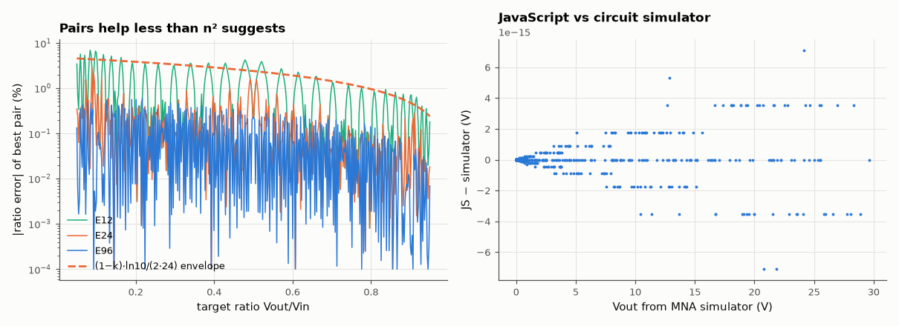

# SL-193 · Voltage divider calculator with live schematic

> An interactive divider calculator: loaded output, Thevenin resistance, worst-case tolerance band, and the best pair of standard E12/E24/E96 resistors for a target ratio. The JavaScript is verified against the circuit simulator and an exhaustive search.



*Best standard-value pair error across target ratios, and agreement of the web tool with the simulator.*

**Track:** Signal Lab — 214 electrical-engineering projects · **Category:** K. Interactive tools & web apps · **Level:** Easy · **Tools:** HTML/SVG/JavaScript tool (GitHub Pages) + Node test harness; references: own MNA circuit simulator and brute-force search

**Data:** Generated test vectors.

## Problem

Everyone needs R1 and R2 for 'turn 5 V into 3.3 V'. How close can standard values get, and what does loading do?

## Prediction

$V_\text{out}=V_\text{in}\,\frac{R_2\parallel R_L}{R_1+R_2\parallel R_L}$, $R_\text{th}=R_1\parallel R_2$. With $n$ values per decade the logarithmic spacing is $10^{1/n}$, so a single
resistor is within $\pm\tfrac12\cdot\ln 10/n$ (±4.8 % E24). My first guess: choosing *both* resistors gives ~n² ratios per decade pair, so the best ratio error
should be an order of magnitude smaller — ≤ 0.5 % worst case for E24 and ≤ 0.1 % for E96. (This turned out to be wrong; see the discussion.) A ±1 % pair gives at most ±2(1−k)·1 % output error, k = ratio.

## Method

(1) 500 random (Vin, R1, R2, RL) cases: calc.js vs the MNA simulator's DC operating point. (2) 400 target ratios 0.05–0.95: calc.js `bestPair` vs a
brute-force Python search over the same series (both constrained to 1 kΩ–1 MΩ total). (3) Worst-case band vs Monte-Carlo corners.

## Measured results

*Predicted vs measured vs error. "Measured" = computed by an independent simulation, HDL simulator or public dataset.*

| Quantity | Predicted | Measured | Error | Within tolerance |
|---|---|---|---|---|
| Max |Vout(JS) − Vout(MNA simulator)| over 500 random loaded dividers | 0 V | 7.105 fV | +7.105 fV | yes |
| E96 table in calc.js vs IEC 60063 values (mismatches) | 0 | 0 | +0 |  |
| E24: corrected model — worst error ÷ (1−k)·ln10/(2n) envelope (≤ 1 expected) | 1 | 0.6634 | -0.3366 |  |
| E24: worst best-pair ratio error over 400 targets | 0.5 % | 2.901 % | +2.4 pp |  |
| E96: worst best-pair ratio error over 400 targets | 0.1 % | 0.5989 % | +0.499 pp |  |
| ±1 % pair, 5 V → 3.24 V: worst-case half-width = 2(1−k)·1 %·Vout | 22.84 mV | 22.84 mV | +0.00 % | yes |

**Additional measurements**

| Quantity | Value | Note |
|---|---|---|
| E12: JS search misses the brute-force optimum by at most | 0 pp |  |
| E24: JS search misses the brute-force optimum by at most | 0 pp |  |
| E96: JS search misses the brute-force optimum by at most | 0 pp |  |
| Monte-Carlo (uniform ±1 %) spread stays inside the band | 1 |  |

## Error analysis

The web tool's arithmetic matches the circuit simulator to floating-point precision, and its search finds the same optimum as a brute-force
scan. But my headline prediction was wrong: the worst E24 pair error is 2.9 %, not ≤ 0.5 %. The n²-combinations argument
fails because the E-series is (almost) geometric — values are ≈ 10^(i/n) — so the ratio R1/R2 ≈ 10^((i−j)/n) takes only about n distinct values per
decade, the *same* spacing as a single resistor. Since k = 1/(1 + R1/R2), a relative step in R1/R2 moves k by (1−k) times as much, giving the corrected
envelope (1−k)·ln10/(2n): bad for small ratios (attenuating dividers), excellent near k → 1. The historical rounding of E24 values (3.0, 3.3, 3.6 …
are not exactly geometric) is what occasionally beats the envelope. Practical consequences: use E96, use three resistors (series/parallel trim),
or accept the error; and resistor tolerance still matters — a ±1 % pair already moves 3.3 V by ±23 mV. Loading matters more than either: the tool
shows how an RL comparable to R2 collapses the output, which is why dividers feeding ADCs are kept low-impedance or buffered.

## Reproduce

```bash
pip install -r requirements.txt
python run_all.py --only SL-193
```

The script [`project.py`](project.py) regenerates every figure and number above.

**Files produced**

- [`web/index.html`](web/index.html) — interactive tool
- [`web/calc.js`](web/calc.js) — calculation library (tested)

## License

Code and text: MIT (see the repository [LICENSE](../../../../LICENSE)). Datasets remain under their own licences (see the repository README).

---

**Tooling & honesty.** This project was generated with Claude Code (Anthropic's AI coding assistant): the code, derivations, simulations and this write-up were AI-produced. *Measured* means computed by an independent model, simulator or public dataset — not a physical lab bench. Every number in the tables is reproduced by running the code.
