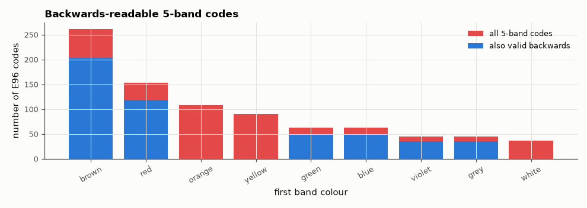

# SL-194 · Resistor colour-code decoder and encoder

> Two-way conversion between resistance and 4-/5-band colour codes with a visual resistor; verified by round-tripping every E24 and E96 value over nine to ten decades and by counting how many real codes can be misread backwards.



*A 5-band code is ambiguous when its first digit colour is also a tolerance colour and its multiplier is a digit.*

**Track:** Signal Lab — 214 electrical-engineering projects · **Category:** K. Interactive tools & web apps · **Level:** Easy · **Tools:** HTML/SVG/JavaScript two-way tool with a clickable band picker; Node test harness vs an independent Python implementation and textbook examples

**Data:** Generated from the IEC 60063 E-series tables.

## Problem

Colour codes are easy to misread — especially backwards. Build a converter you can trust and quantify the ambiguity.

## Prediction

IEC 60062: digit bands (black 0 … white 9), multiplier band (10^k, gold 0.1, silver 0.01), tolerance band (brown 1 %, red 2 %, gold 5 %, silver 10 % …).
Two significant digits (4-band) represent every E24 value exactly; three digits (5-band) represent E96. Round-trip value → colours → value must be
exact. Reading backwards: a 4-band code with a gold/silver tolerance band can never be read backwards (gold is not a digit), but 5-band 1 % codes
end in brown, which *is* a digit — so I expect many 5-band codes to also decode (wrongly) when reversed.

## Method

calc.js `encode`/`decode` run under Node for all E24 values (4-band, 5 %) and E96 values (5-band, 1 %) over decades 0.1 Ω–1 GΩ; decoded values compared with the inputs;
colours compared with an independent Python encoder; five textbook examples; reverse-readability counted.

## Measured results

*Predicted vs measured vs error. "Measured" = computed by an independent simulation, HDL simulator or public dataset.*

| Quantity | Predicted | Measured | Error |
|---|---|---|---|
| Round-trip failures over 240 E24 + 864 E96 values (E24 0.1 Ω–910 MΩ, E96 1 Ω–976 MΩ) | 0 | 0 | +0 |
| Colour mismatches vs independent Python encoder | 0 | 0 | +0 |
| Textbook examples decoded correctly | 5 | 5 | +0 |
| 4-band 5 % codes readable backwards (gold is not a digit → 0 %) | 0 % | 0 % | +0 pp |
| 5-band 1 % codes that also decode when read backwards | 56.71 % | 56.71 % | +0 pp |

**Additional measurements**

| Quantity | Value | Note |
|---|---|---|
| E96 values below 1 Ω that 5 bands cannot encode (smallest multiplier is silver ×0.01) | 96 of 96 |  |

## Error analysis

Every E24 value from 0.1 Ω and every E96 value from 1 Ω up to the GΩ range survives value → colours → value exactly, and the colours agree with an independently written encoder,
so the tool is trustworthy as a converter. (Sub-ohm precision values cannot be written in five bands at all — three digits × 0.01 bottoms out at
1.00 Ω — so such parts are marked with printed codes instead.) The more interesting result is ambiguity: 4-band 5 % resistors can never be read backwards
because gold is not a digit colour, but 57 % of 5-band 1 % codes decode to a *different valid value* when reversed — exactly the
fraction predicted by counting codes whose first digit is also a tolerance colour and whose multiplier band is a digit colour. That is why
5-band parts usually have a wider gap before the tolerance band, and why the tool shows the warning.

## Reproduce

```bash
pip install -r requirements.txt
python run_all.py --only SL-194
```

The script [`project.py`](project.py) regenerates every figure and number above.

**Files produced**

- [`web/index.html`](web/index.html) — interactive tool
- [`web/calc.js`](web/calc.js) — encode/decode library (tested)

## License

Code and text: MIT (see the repository [LICENSE](../../../../LICENSE)). Datasets remain under their own licences (see the repository README).

---

**Tooling & honesty.** This project was generated with Claude Code (Anthropic's AI coding assistant): the code, derivations, simulations and this write-up were AI-produced. *Measured* means computed by an independent model, simulator or public dataset — not a physical lab bench. Every number in the tables is reproduced by running the code.
