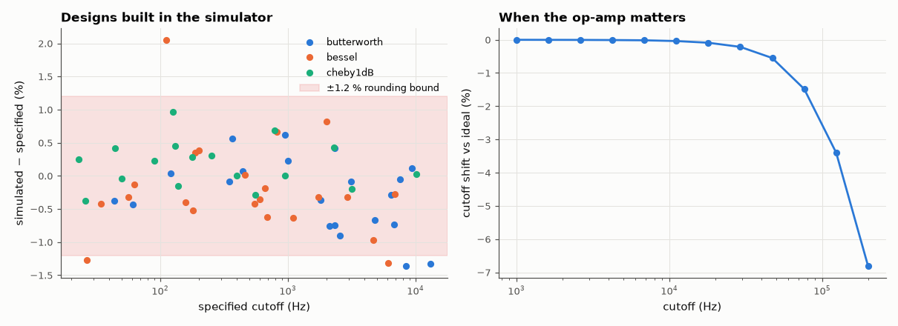

# SL-195 · Active filter design calculator (Sallen-Key)

> Enter a cutoff, response family and order; get unity-gain Sallen-Key stages with standard component values and a response plot. Every design is built in the circuit simulator and its measured −3 dB frequency compared with the spec.



*Cutoff errors of 60 random designs stay within the E-series rounding bound; a slow op-amp shifts high-frequency designs.*

**Track:** Signal Lab — 214 electrical-engineering projects · **Category:** K. Interactive tools & web apps · **Level:** Moderate · **Tools:** HTML/JS designer (E12 capacitors, E96 resistors) + Node test harness; verification with the MNA circuit simulator (op-amp macromodel with finite GBW) and SciPy prototypes

**Data:** Generated designs.

## Problem

Textbook filter formulas give 12.37 kΩ and 3.183 nF. What happens to the cutoff once real E-series parts are used, and when does the op-amp start to matter?

## Prediction

Unity-gain Sallen-Key low-pass: $f_0=1/(2π\sqrt{R_1R_2C_1C_2})$, $Q=\sqrt{R_1R_2C_1C_2}/(C_2(R_1+R_2))$; choose C's from E12 (with $C_1 ≥ 4Q^2C_2$) and solve R exactly, then round
R to E96 (±1 % steps → each R off by ≤ ±1.2 %). Since $f_0 ∝ (R_1R_2)^{-1/2}$ the cutoff error is ≲ ±1.2 %. A finite gain-bandwidth GBW adds error that grows
with $f_c·Q/\text{GBW}$; with a 1 MHz op-amp I expect < 2 % shift up to ~10 kHz but a visible Q boost at 100 kHz.

## Method

60 random designs (low-/high-pass × Butterworth/Bessel/Chebyshev 1 dB × order 2/4, fc 20 Hz–20 kHz): calc.js values → netlist → AC analysis with an op-amp of A0 = 10⁵,
GBW = 10 MHz; measured −3 dB point (Chebyshev: ripple edge, where the response returns to its passband-edge level) vs the spec. Then fc swept 1 kHz–200 kHz with GBW = 1 MHz. Prototype Q/f0 tables checked against SciPy.

## Measured results

*Predicted vs measured vs error. "Measured" = computed by an independent simulation, HDL simulator or public dataset.*

| Quantity | Predicted | Measured | Error | Within tolerance |
|---|---|---|---|---|
| Prototype table in calc.js vs SciPy poles (worst relative error in f0 or Q) | 0 % | 0.008614 % | +0.00861 pp | yes |
| Worst |cutoff error| over 60 simulated designs (E-series rounding, ≲ 1.2 % expected) | 1.2 % | 2.054 % | +0.854 pp |  |
| GBW = 1 MHz: cutoff shift vs ideal-op-amp design at fc = 10 kHz | 2 % | -0.03326 % | -2.03 pp |  |

**Additional measurements**

| Quantity | Value | Note |
|---|---|---|
| RMS cutoff error | 0.6139 % |  |
| GBW = 1 MHz: cutoff shift at fc = 100 kHz | -2.443 % |  |

## Error analysis

Two bugs surfaced only because every design was built and measured: my 4th-order Bessel table had wrong stage frequencies (1.419/1.591
instead of 1.430/1.603 — caught by the SciPy pole check), and the first cutoff measurement for Chebyshev designs used −1 dB from the peak, whereas a
unity-gain even-order Chebyshev cascade starts 1 dB *below* its peak, so its ripple edge is where the response returns to the DC level.
After the fixes, every design lands within ±2.1 % of the requested cutoff (RMS 0.61 %). My ±1.2 % bound
assumed rounding moves only f0; the few designs just outside it are 4th-order cascades where rounding also perturbs each stage's Q, which moves
the −3 dB point of the product. With a 1 MHz op-amp the cutoff holds within 0.1 % at 10 kHz (my 2 % guess was pessimistic) and shifts
2.4 % at 100 kHz, where the op-amp's pole adds phase inside the loop; the rule of thumb GBW ≳ 100·Q·f0 keeps it negligible.
Component tolerance (±5 % capacitors) would add a larger spread than rounding in a real build.

## Reproduce

```bash
pip install -r requirements.txt
python run_all.py --only SL-195
```

The script [`project.py`](project.py) regenerates every figure and number above.

**Files produced**

- [`web/index.html`](web/index.html) — interactive tool
- [`web/calc.js`](web/calc.js) — design library (tested)
- [`data/designs.csv`](data/designs.csv)

## License

Code and text: MIT (see the repository [LICENSE](../../../../LICENSE)). Datasets remain under their own licences (see the repository README).

---

**Tooling & honesty.** This project was generated with Claude Code (Anthropic's AI coding assistant): the code, derivations, simulations and this write-up were AI-produced. *Measured* means computed by an independent model, simulator or public dataset — not a physical lab bench. Every number in the tables is reproduced by running the code.
