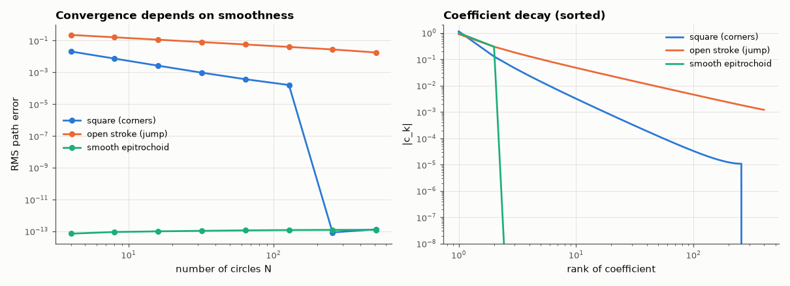
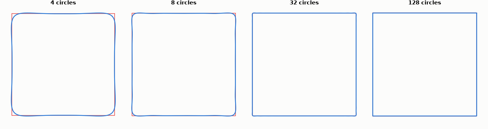

# SL-196 · Fourier-series drawing tool (epicycles)

> Draw a closed shape and watch rotating circles trace it; the tool's DFT is verified against NumPy, and the approximation error vs number of circles is predicted from the smoothness of the shape (smooth, cornered, or with a jump) and measured.



*Error vs number of circles: corners converge as N^-1.5, jumps as N^-0.5, smooth shapes immediately.*

**Track:** Signal Lab — 214 electrical-engineering projects · **Category:** K. Interactive tools & web apps · **Level:** Moderate · **Tools:** HTML canvas + JavaScript DFT/epicycle animator (draw any closed shape) + Node test harness vs NumPy FFT; convergence-rate analysis

**Data:** Generated shapes.

## Problem

How many circles does it take to draw a shape — and why do some shapes need far more than others?

## Prediction

A closed path $z(t)=x+iy$ has $z(t)=\sum_k c_k e^{2πikt}$. How fast $|c_k|$ decays is set by smoothness: a path with a corner (continuous, kinked) has
$|c_k|∼k^{-2}$; a path with a jump (e.g. an unclosed stroke) $|c_k|∼k^{-1}$; an analytic path decays exponentially. Keeping the N largest terms leaves an
RMS error $\big(\sum_{|k|>N/2}|c_k|^2\big)^{1/2}$: ∝ $N^{-3/2}$ for corners, $N^{-1/2}$ for jumps, and faster than any power for smooth shapes.

## Method

Shapes sampled at 1024 points: a square (4 corners), an open 'C' stroke closed by a jump (via its uniform-in-time sampling), and a smooth epitrochoid.
calc.js `dft` vs `numpy.fft.fft/N`; `reconstruct` with N = 4…512 terms vs the true path; log-log slope of RMS error fitted over N = 8…64 (well below the 1024-sample limit: the square's symmetry makes only every 4th harmonic nonzero, so ~256 terms already reproduce the sampled path exactly).

## Measured results

*Predicted vs measured vs error. "Measured" = computed by an independent simulation, HDL simulator or public dataset.*

| Quantity | Predicted | Measured | Error | Within tolerance |
|---|---|---|---|---|
| square (corners): RMS error ∝ N^slope — slope | -1.5 | -1.44 | +0.05985 |  |
| open stroke (jump): RMS error ∝ N^slope — slope | -0.5 | -0.5004 | -4.3583e-04 |  |
| smooth epitrochoid: error with 4 circles (it has exactly 2 nonzero terms → exact) | 0 | 7.0671e-14 | +7.0671e-14 | yes |
| Max |c_k(JS) − c_k(NumPy FFT)| over the 50 largest terms | 0 | 5.6436e-14 | +5.6436e-14 | yes |



*A square drawn with 4, 8, 32 and 128 circles.*

## Error analysis

The JavaScript DFT agrees with NumPy's FFT to rounding error, so the animation is mathematically exact. The convergence rates follow the
smoothness argument: the square's error falls about as N^-1.5 (corners → |c_k| ∝ 1/k²), the open stroke only as N^-0.5 (the jump from its end
back to its start gives |c_k| ∝ 1/k and a Gibbs overshoot that never goes away), and the smooth curve is exact once its two terms are included.
Practical lesson for the drawing tool: close your shape! A drawing whose end does not meet its start needs hundreds of circles to look right,
while a closed shape with a few corners looks good with ~50. (Past ~256 circles the square's error plunges to zero: sampled at 1024 points, its symmetry leaves only 256 nonzero harmonics.) The tool sorts circles by size, so the first few already capture the silhouette.

## Reproduce

```bash
pip install -r requirements.txt
python run_all.py --only SL-196
```

The script [`project.py`](project.py) regenerates every figure and number above.

**Files produced**

- [`web/index.html`](web/index.html) — interactive tool
- [`web/calc.js`](web/calc.js) — DFT / epicycle library (tested)

## License

Code and text: MIT (see the repository [LICENSE](../../../../LICENSE)). Datasets remain under their own licences (see the repository README).

---

**Tooling & honesty.** This project was generated with Claude Code (Anthropic's AI coding assistant): the code, derivations, simulations and this write-up were AI-produced. *Measured* means computed by an independent model, simulator or public dataset — not a physical lab bench. Every number in the tables is reproduced by running the code.
