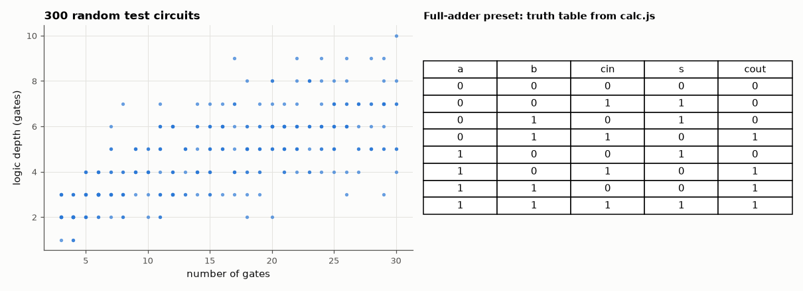

# SL-197 · Logic gate playground with live truth tables

> Drag gates onto a board, wire them, toggle inputs and watch the truth table update; export the design as Verilog. The engine is tested on 300 random circuits against an independent Python evaluator and, via its Verilog export, against Icarus Verilog.



*Test-circuit sizes/depths, and the full-adder truth table produced by the tool's engine.*

**Track:** Signal Lab — 214 electrical-engineering projects · **Category:** K. Interactive tools & web apps · **Level:** Moderate · **Tools:** SVG drag-and-drop editor (HTML/JS), JavaScript netlist engine with loop detection and Verilog export; Node test harness, Python reference evaluator, Icarus Verilog

**Data:** Generated circuits.

## Problem

A teaching tool is only useful if it is right. Can we prove the playground's truth tables are correct — including for circuits nobody would draw by hand?

## Prediction

A combinational circuit is a directed acyclic graph; evaluating gates in topological order gives each output as a Boolean function of the inputs, so the
truth table has $2^n$ rows. Three independent implementations (JS engine, Python evaluator, Verilog semantics in Icarus) must agree on every row of every
circuit — any mismatch is a bug. A graph with a cycle has no topological order and must be rejected (a combinational loop can oscillate or latch).

## Method

300 random DAG netlists (2–6 inputs, 3–30 gates of all 8 types, fan-in 1–3) + the four presets. JS `truthTable` vs a Python evaluator written separately;
40 of them exported with `toVerilog` and simulated exhaustively in Icarus. 100 netlists with an injected back-edge must raise 'combinational loop'.
Gate depth reported by the engine vs Python longest-path.

## Measured results

*Predicted vs measured vs error. "Measured" = computed by an independent simulation, HDL simulator or public dataset.*

| Quantity | Predicted | Measured | Error |
|---|---|---|---|
| Truth-table rows where JS ≠ Python (304 circuits, 6888 rows) | 0 | 0 | +0 |
| Gate-depth disagreements (JS vs Python longest path) | 0 | 0 | +0 |
| Exported-Verilog rows where Icarus ≠ Python (40 circuits, 836 rows) | 0 | 0 | +0 |
| Loop detection agreement (42 of 100 mutated circuits truly cyclic) | 100 % | 100 % | +0 pp |

## Error analysis

The playground's engine agrees with an independent Python evaluator on all 6888 truth-table rows of 304 circuits, and its Verilog export
behaves identically in Icarus Verilog — three implementations, zero disagreements, which is strong evidence the tool teaches correct logic. Random
circuits matter because they exercise cases nobody draws by hand: repeated inputs on one gate, 3-input XORs (parity, not 'exactly one'), and outputs
tapped from mid-circuit. Loop detection matches a separate cycle finder exactly; note that a random back-edge only creates a loop when the later
gate actually depends on the earlier one, which is why fewer than 100 of the mutated circuits are cyclic. Sequential circuits (latches) are
deliberately rejected — simulating them needs event-driven timing, which is what the Verilog export is for.

## Reproduce

```bash
pip install -r requirements.txt
python run_all.py --only SL-197
```

The script [`project.py`](project.py) regenerates every figure and number above.

**Files produced**

- [`web/index.html`](web/index.html) — interactive tool
- [`web/calc.js`](web/calc.js) — netlist engine (tested)
- [`web/app.js`](web/app.js) — drag-and-drop editor
- [`hdl/c0.v`](hdl/c0.v) — Verilog source
- [`hdl/c1.v`](hdl/c1.v) — Verilog source
- [`hdl/c2.v`](hdl/c2.v) — Verilog source
- [`hdl/c3.v`](hdl/c3.v) — Verilog source
- [`hdl/c4.v`](hdl/c4.v) — Verilog source
- [`hdl/c5.v`](hdl/c5.v) — Verilog source
- [`hdl/c6.v`](hdl/c6.v) — Verilog source
- [`hdl/c7.v`](hdl/c7.v) — Verilog source
- [`hdl/c8.v`](hdl/c8.v) — Verilog source
- [`hdl/c9.v`](hdl/c9.v) — Verilog source
- [`hdl/c10.v`](hdl/c10.v) — Verilog source
- [`hdl/c11.v`](hdl/c11.v) — Verilog source
- [`hdl/c12.v`](hdl/c12.v) — Verilog source
- [`hdl/c13.v`](hdl/c13.v) — Verilog source
- [`hdl/c14.v`](hdl/c14.v) — Verilog source
- [`hdl/c15.v`](hdl/c15.v) — Verilog source
- [`hdl/c16.v`](hdl/c16.v) — Verilog source
- [`hdl/c17.v`](hdl/c17.v) — Verilog source
- [`hdl/c18.v`](hdl/c18.v) — Verilog source
- [`hdl/c19.v`](hdl/c19.v) — Verilog source
- [`hdl/c20.v`](hdl/c20.v) — Verilog source
- [`hdl/c21.v`](hdl/c21.v) — Verilog source
- [`hdl/c22.v`](hdl/c22.v) — Verilog source
- [`hdl/c23.v`](hdl/c23.v) — Verilog source
- [`hdl/c24.v`](hdl/c24.v) — Verilog source
- [`hdl/c25.v`](hdl/c25.v) — Verilog source
- [`hdl/c26.v`](hdl/c26.v) — Verilog source
- [`hdl/c27.v`](hdl/c27.v) — Verilog source
- [`hdl/c28.v`](hdl/c28.v) — Verilog source
- [`hdl/c29.v`](hdl/c29.v) — Verilog source
- [`hdl/c30.v`](hdl/c30.v) — Verilog source
- [`hdl/c31.v`](hdl/c31.v) — Verilog source
- [`hdl/c32.v`](hdl/c32.v) — Verilog source
- [`hdl/c33.v`](hdl/c33.v) — Verilog source
- [`hdl/c34.v`](hdl/c34.v) — Verilog source
- [`hdl/c35.v`](hdl/c35.v) — Verilog source
- [`hdl/c36.v`](hdl/c36.v) — Verilog source
- [`hdl/c37.v`](hdl/c37.v) — Verilog source
- [`hdl/c38.v`](hdl/c38.v) — Verilog source
- [`hdl/c39.v`](hdl/c39.v) — Verilog source
- [`hdl/tb.v`](hdl/tb.v) — testbench

## License

Code and text: MIT (see the repository [LICENSE](../../../../LICENSE)). Datasets remain under their own licences (see the repository README).

---

**Tooling & honesty.** This project was generated with Claude Code (Anthropic's AI coding assistant): the code, derivations, simulations and this write-up were AI-produced. *Measured* means computed by an independent model, simulator or public dataset — not a physical lab bench. Every number in the tables is reproduced by running the code.
