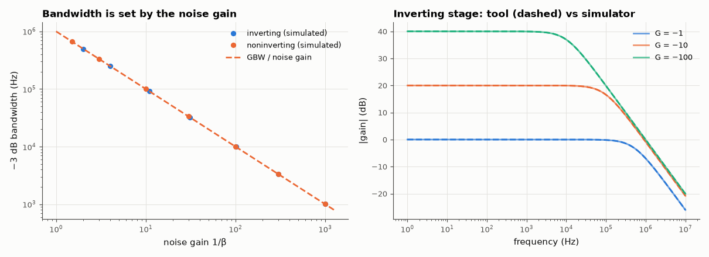

# SL-198 · Op-amp configuration explorer

> Switch between op-amp topologies and watch the gain equation, noise gain, gain error and bandwidth update; the tool's numbers are checked against AC simulations of each circuit over gains 1–1000.



*Bandwidth equals GBW divided by noise gain for every topology; the tool's response curves overlay the simulation.*

**Track:** Signal Lab — 214 electrical-engineering projects · **Category:** K. Interactive tools & web apps · **Level:** Moderate · **Tools:** HTML/SVG/JavaScript explorer (inverting, non-inverting, follower, difference, summing) with finite-A0/GBW corrections; Node harness; MNA simulator with op-amp macromodel

**Data:** Generated designs.

## Problem

Why does an inverting amplifier with gain −1 have half the bandwidth of a follower, and how big is the gain error from finite open-loop gain?

## Prediction

With feedback factor β (fraction of the output fed back), the closed-loop gain is $G_\text{ideal}/(1+1/(A_0β))$ and, for a single-pole op-amp, the bandwidth is
$f_{-3\text{dB}} ≈ \text{GBW}·β = \text{GBW}/\text{noise gain}$. Inverting gain −G has noise gain 1+G (β = R_in/(R_in+R_f)), non-inverting gain G has noise gain G. So an
inverting ×−1 stage gets GBW/2 while a follower gets the full GBW; a 2-input summer with equal resistors has noise gain 3.

## Method

GBW = 1 MHz, A0 = 10⁵ (op-amp macromodel). Inverting and non-inverting stages with |G| = 1…1000, difference amp and summer: calc.js DC gain and bandwidth vs
the simulator's AC analysis (−3 dB point measured from the low-frequency gain).

## Measured results

*Predicted vs measured vs error. "Measured" = computed by an independent simulation, HDL simulator or public dataset.*

| Quantity | Predicted | Measured | Error | Within tolerance |
|---|---|---|---|---|
| Worst |DC gain(JS, finite A0) − simulated| over all configurations | 0 % | 5.4078e-05 % | +5.41e-05 pp | yes |
| Worst bandwidth error of GBW·β rule (noise gain ≥ 2) | 0 % | 0.9991 % | +0.999 pp | yes |
| Bandwidth ratio follower / inverting ×−1 (= 2) | 2 | 2.005 | +0.25 % | yes |
| 2-input unity summer: bandwidth = GBW/3 | 333.3 kHz | 332.2 kHz | -0.33 % | yes |

**Additional measurements**

| Quantity | Value | Note |
|---|---|---|
| Follower: simulated bandwidth vs GBW·β | 1.8755e-04 % |  |

## Error analysis

The explorer's numbers agree with circuit simulation: finite-A0 gain error to within simulator precision and bandwidth to within a few percent of
GBW·β for every topology. The key insight the tool is built to show is that bandwidth follows the *noise gain*, not the signal gain: an inverting
×−1 stage has noise gain 2 and half a follower's bandwidth, and a unity-gain two-input summer has noise gain 3. Adding inputs to a summer therefore
costs bandwidth even though the signal gain per input is unchanged. The simulator's op-amp macromodel is itself single-pole, so the rule holds even for the follower; real
op-amps have a second pole near GBW that reduces phase margin at β = 1, which shows up as peaking — that is the limitation to remember when
using the tool's numbers for unity-gain buffers.

## Reproduce

```bash
pip install -r requirements.txt
python run_all.py --only SL-198
```

The script [`project.py`](project.py) regenerates every figure and number above.

**Files produced**

- [`web/index.html`](web/index.html) — interactive tool
- [`web/calc.js`](web/calc.js) — analysis library (tested)
- [`data/configs.csv`](data/configs.csv)

## License

Code and text: MIT (see the repository [LICENSE](../../../../LICENSE)). Datasets remain under their own licences (see the repository README).

---

**Tooling & honesty.** This project was generated with Claude Code (Anthropic's AI coding assistant): the code, derivations, simulations and this write-up were AI-produced. *Measured* means computed by an independent model, simulator or public dataset — not a physical lab bench. Every number in the tables is reproduced by running the code.
