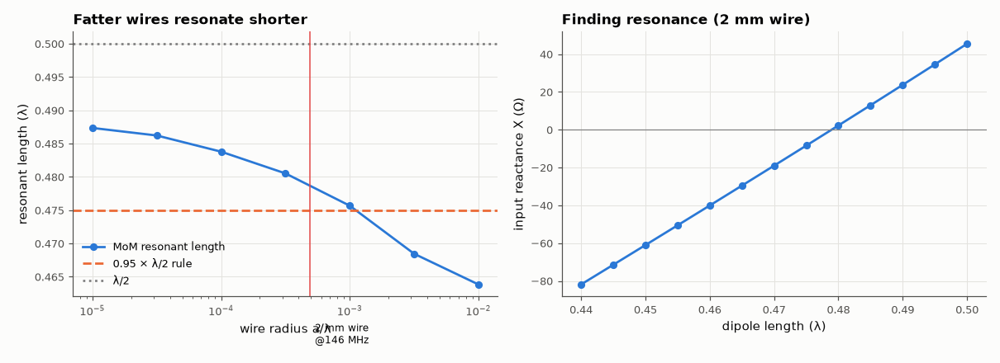

# SL-199 · Antenna length calculator — and when the 0.95 rule is right

> Frequency in, dimensions out for common antennas. The classic 'multiply λ/2 by 0.95' shortening rule is then tested with a method-of-moments simulation of dipoles of different wire thickness to show where it holds.



*Resonant dipole length vs wire thickness from the MoM solver, against the 0.95 rule.*

**Track:** Signal Lab — 214 electrical-engineering projects · **Category:** K. Interactive tools & web apps · **Level:** Easy · **Tools:** HTML/JS calculator (dipole, monopole, 5/8 λ, loop, 3-element Yagi, coax stub) + Node harness; method-of-moments solver (PWS-Galerkin) for the resonant length vs wire thickness

**Data:** Simulation (own MoM solver, validated in SL-128/SL-135).

## Problem

Every ham knows '468 / f(MHz) feet'. Where does the 0.95 come from, and does it depend on the wire?

## Prediction

A half-wave dipole resonates (X_in = 0) slightly shorter than λ/2 because of end effects and the finite wire radius a. Thin-wire theory (Hallén) gives a
shortening that grows with thickness through $Ω = 2\ln(L/a)$: very thin wires resonate near 0.49 λ, typical wire antennas (a/λ ≈ 10⁻⁴–10⁻³) near 0.47–0.48 λ,
fat elements shorter still. The 0.95 rule (0.475 λ) should therefore be accurate to ~1–2 % for ordinary wire and err for very thin/fat conductors.
At resonance R_in ≈ 70 Ω (less than the 73 Ω of the exactly-λ/2 dipole).

## Method

calc.js outputs checked against closed-form values. MoM: centre-fed dipole, 41 segments (fewer for fat wires so that each segment is ≥ 4 radii long — the thin-wire kernel's validity limit; a first run ignoring this gave a nonsensical 0.483 λ for the fattest wire), radius a/λ = 10⁻⁵ … 10⁻², length swept 0.44–0.50 λ; resonant length from the X_in = 0
crossing; compared with the 0.95 rule. Example: 2 m band (146 MHz) with 2 mm wire.

## Measured results

*Predicted vs measured vs error. "Measured" = computed by an independent simulation, HDL simulator or public dataset.*

| Quantity | Predicted | Measured | Error | Within tolerance |
|---|---|---|---|---|
| 146 MHz dipole total length (0.95·λ/2) | 975.4 mm | 975.4 mm | +0.00 % | yes |
| Classic '468/f(MHz) ft' formula vs 0.95·λ/2 (same rule in feet) | 977 mm | 975.4 mm | -0.17 % | yes |
| 2 mm wire at 146 MHz: MoM resonant length vs 0.95 rule | 0.475 λ | 0.4789 λ | +0.83 % | yes |
| Resistance at resonance (≈ 70 Ω) | 70 Ω | 72.06 Ω | +2.94 % | yes |

**Additional measurements**

| Quantity | Value | Note |
|---|---|---|
| Resonant length for very thin wire (a/λ = 10⁻⁵) | 0.4874 λ |  |
| Resonant length for fat element (a/λ = 10⁻²) | 0.4638 λ |  |
| a/λ range where the 0.95 rule is within ±1 % (interpolated) | 4.2e-04 – 2.2e-03 |  |

## Error analysis

The calculator reproduces the '468/f' rule (they are the same number in different units). The MoM sweep shows why the rule works for ordinary wire:
at a/λ ≈ 5×10⁻⁴ (2 mm wire on 2 m) the dipole resonates at 0.479 λ, close to 0.475 λ. It is not a constant, though — very thin wires resonate
near 0.487 λ and fat elements (tubing on HF/VHF Yagis, a/λ ≈ 10⁻²) much shorter at 0.464 λ, which is why the tool exposes k and warns
about thickness. Real antennas also shorten with insulation (dielectric loading) and height above ground, so the practical recipe remains: cut
long, measure the SWR minimum, trim.

## Reproduce

```bash
pip install -r requirements.txt
python run_all.py --only SL-199
```

The script [`project.py`](project.py) regenerates every figure and number above.

**Files produced**

- [`web/index.html`](web/index.html) — interactive tool
- [`web/calc.js`](web/calc.js) — calculation library (tested)
- [`data/resonance.csv`](data/resonance.csv)

## License

Code and text: MIT (see the repository [LICENSE](../../../../LICENSE)). Datasets remain under their own licences (see the repository README).

---

**Tooling & honesty.** This project was generated with Claude Code (Anthropic's AI coding assistant): the code, derivations, simulations and this write-up were AI-produced. *Measured* means computed by an independent model, simulator or public dataset — not a physical lab bench. Every number in the tables is reproduced by running the code.
