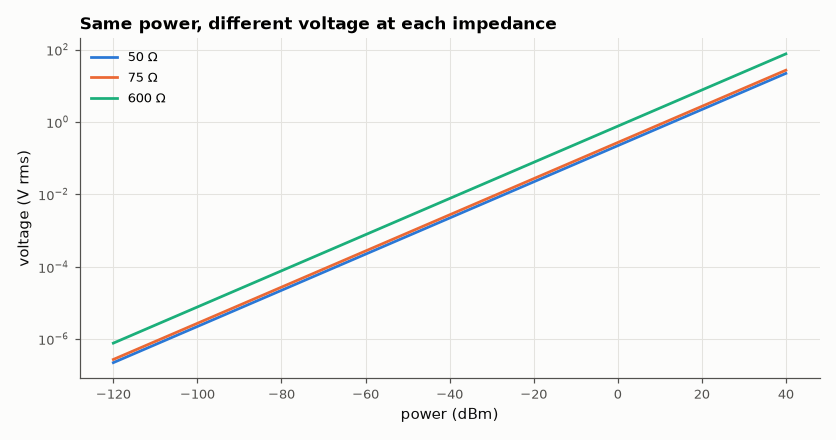

# SL-200 · dB / dBm / watts / volts converter

> Type a level in any unit and see all the others, at 50 Ω, 75 Ω or 600 Ω; includes the kTB noise floor. Verified by round-trips over the whole 10-unit × 10-unit matrix and against textbook anchor values.



*dBm to volts rms for common system impedances.*

**Track:** Signal Lab — 214 electrical-engineering projects · **Category:** K. Interactive tools & web apps · **Level:** Easy · **Tools:** HTML/JS converter (W, mW, dBW, dBm, Vrms, Vpk, Vpp, dBV, dBu, dBµV at any impedance, thermal noise floor) + Node harness vs Python

**Data:** Generated test values.

## Problem

0 dBm is how many volts? The conversion every RF engineer needs daily — and one where 10·log vs 20·log mistakes are common.

## Prediction

Power: dBm = 10·log₁₀(P / 1 mW). Voltage in impedance Z: P = V²_rms/Z, so dBµV = dBm + 90 + 10·log₁₀(Z) (107 dBµV = 0 dBm at 50 Ω). dBu is referenced to
0.7746 V (1 mW in 600 Ω). Sine: V_pk = √2·V_rms, V_pp = 2√2·V_rms. Thermal noise: P = kTB → −174 dBm/Hz at 290 K. A voltage ratio in dB uses 20·log (power ∝ V²);
using 10·log for a voltage ratio halves the dB value.

## Method

All 90 ordered unit pairs × 200 random levels round-tripped through calc.js; anchors: 0 dBm ↔ 223.6 mV rms ↔ 107 dBµV (50 Ω), 0 dBu ↔ 0.7746 V, +30 dBm = 1 W,
thermal noise −173.98 dBm/Hz and −113.9 dBm in 1 MHz; JS vs independent Python formulas.

## Measured results

*Predicted vs measured vs error. "Measured" = computed by an independent simulation, HDL simulator or public dataset.*

| Quantity | Predicted | Measured | Error | Within tolerance |
|---|---|---|---|---|
| Worst relative round-trip error over 1800 conversions (90 unit pairs) | 0 | 4.1045e-14 | +4.1045e-14 | yes |
| Worst disagreement with independent Python formulas (as power ratio) | 0 | 7.9418e-08 | +7.9418e-08 | yes |
| 0 dBm in 50 Ω | 0.2236 V rms | 0.2236 V rms | +0.00 % | yes |
| 0 dBm in 50 Ω | 107 dBµV | 107 dBµV | -0.0103 dBµV | yes |
| 0 dBm in 75 Ω (= 90 + 10·log 75) | 108.8 dBµV | 108.8 dBµV | +0 dBµV | yes |
| 0 dBu | 0.7746 V rms | 0.7746 V rms | -0.00 % | yes |
| +30 dBm | 1 W | 1 W | +0.00 % | yes |
| kT at 290 K | -174 dBm/Hz | -174 dBm/Hz | +0.02481 dBm/Hz | yes |
| kTB, B = 1 MHz | -114 dBm | -114 dBm | +0.02481 dBm | yes |

## Error analysis

All 90 unit-pair conversions round-trip exactly and agree with independently written formulas, and the anchor values every RF engineer memorises
come out right (0 dBm = 224 mV = 107 dBµV in 50 Ω; −174 dBm/Hz). The chart is a reminder that dBm is a *power* unit: the same 0 dBm is 274 mV in 75 Ω
and 775 mV in 600 Ω, so quoting a voltage level without an impedance is ambiguous. The tool computes everything via watts, which structurally prevents
the common 10·log/20·log mix-up.

## Reproduce

```bash
pip install -r requirements.txt
python run_all.py --only SL-200
```

The script [`project.py`](project.py) regenerates every figure and number above.

**Files produced**

- [`web/index.html`](web/index.html) — interactive tool
- [`web/calc.js`](web/calc.js) — conversion library (tested)

## License

Code and text: MIT (see the repository [LICENSE](../../../../LICENSE)). Datasets remain under their own licences (see the repository README).

---

**Tooling & honesty.** This project was generated with Claude Code (Anthropic's AI coding assistant): the code, derivations, simulations and this write-up were AI-produced. *Measured* means computed by an independent model, simulator or public dataset — not a physical lab bench. Every number in the tables is reproduced by running the code.
