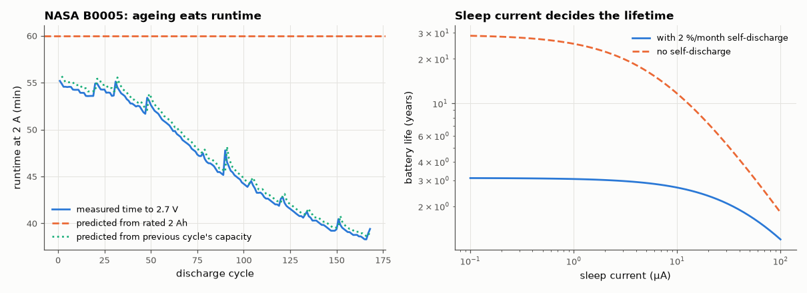

# SL-201 · Battery life estimator with sleep-mode modelling

> Turn a device's current profile (active, radio burst, sleep) into a runtime. The average-current model is checked against a time-stepped coulomb-counting simulation, and the capacity assumption against real discharge runs of an ageing Li-ion cell (NASA B0005).



*Real ageing vs a rated-capacity estimate, and the lifetime of a duty-cycled sensor vs sleep current.*

**Track:** Signal Lab — 214 electrical-engineering projects · **Category:** K. Interactive tools & web apps · **Level:** Easy · **Tools:** HTML/JS estimator (periodic current profile, sleep current, self-discharge, derating) + Node harness; checked against event-level coulomb counting and NASA Li-ion discharge data

**Data:** Real: NASA Ames PCoE Li-ion Battery Aging dataset (Saha & Goebel 2007), public domain (US Government work).

## Problem

A sensor wakes every minute. Will it run for a week or a year — and which number on the datasheet matters most?

## Prediction

For a periodic profile the average current is $\bar I=\sum I_k t_k/T$ and runtime $= C_\text{usable}/(\bar I + I_\text{self})$. In duty-cycled designs the sleep current
often dominates: with 20 ms at 10 mA plus a 5 ms, 40 mA radio burst every 60 s, activity averages only 6.7 µA, so a 5 µA sleep current is ≈ 43 % of the whole budget. Usable capacity is
below rated capacity (cut-off voltage, ageing): runtime predicted from the *rated* 2 Ah will overestimate an aged cell's run by the capacity fade.

## Method

(1) 300 random profiles: calc.js runtime vs a Python simulation that steps through every wake-up (1 ms resolution within active phases) until the charge
is used. (2) NASA B0005 18650 cell, 2 A constant-current discharges to 2.7 V, 168 cycles: predicted runtime from rated 2.0 Ah (derate 1) vs the measured
time to cut-off; and prediction using the previous cycle's measured capacity (what a fuel gauge would know).

## Measured results

*Predicted vs measured vs error. "Measured" = computed by an independent simulation, HDL simulator or public dataset.*

| Quantity | Predicted | Measured | Error | Within tolerance |
|---|---|---|---|---|
| Worst |average-current model − coulomb-counting simulation| (300 profiles) | 0 % | 9.7503e-04 % | +0.000975 pp | yes |
| Default profile: share of charge used while asleep (5 µA sleep) | 0.4285 | 0.4285 | +0.00 % | yes |
| Fresh cell (cycle 1): runtime at 2 A predicted from rated 2 Ah vs measured | 1 h | 0.9198 h | -8.02 % | yes |
| Aged cell (last cycle): same rated-capacity prediction vs measured | 1 h | 0.6568 h | -34.32 % | **no** |
| Using the previous cycle's measured capacity: RMS runtime error | 0 % | 1.318 % | +1.32 pp | yes |

## Error analysis

The tool's average-current arithmetic matches an explicit wake-by-wake coulomb count exactly, so the maths is right; the uncertainty lives in the
inputs. The NASA cell shows which input: fresh, the rated 2 Ah predicts 60 min at 2 A while the cell delivered 55 min
(rated capacity is not usable capacity to a 2.7 V cut-off); after 168 cycles it delivered only 39 min — the rated-capacity
estimate is then 52 % optimistic. Using the previous cycle's measured capacity (what a fuel gauge learns) brings the error
to a few percent, the remainder being cycle-to-cycle variation including capacity recovery after rest periods. For duty-cycled sensors the right-
hand plot is the lesson: once sleep current exceeds a few µA it dominates the budget, and at sub-µA sleep the lifetime is capped by self-
discharge instead — no firmware optimisation beats the battery's own leakage. The default 0.85 derating is a design margin, not a measured value.

## Reproduce

```bash
pip install -r requirements.txt
python run_all.py --only SL-201
```

The script [`project.py`](project.py) regenerates every figure and number above.

**Files produced**

- [`web/index.html`](web/index.html) — interactive tool
- [`web/calc.js`](web/calc.js) — estimator library (tested)
- [`data/nasa_b0005.csv`](data/nasa_b0005.csv)

## License

Code and text: MIT (see the repository [LICENSE](../../../../LICENSE)). Datasets remain under their own licences (see the repository README).

---

**Tooling & honesty.** This project was generated with Claude Code (Anthropic's AI coding assistant): the code, derivations, simulations and this write-up were AI-produced. *Measured* means computed by an independent model, simulator or public dataset — not a physical lab bench. Every number in the tables is reproduced by running the code.
