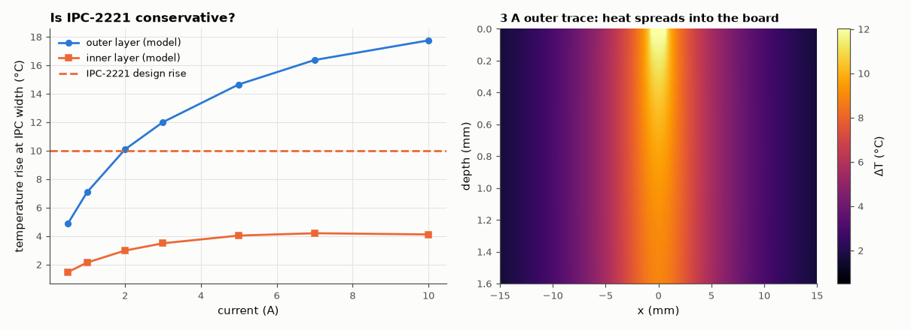

# SL-202 · PCB trace width calculator (IPC-2221) vs a thermal model

> Current and allowed temperature rise in, trace width out, per IPC-2221 — plus resistance, voltage drop and dissipation. The formula's temperature rise is then checked against a 2-D thermal simulation of the trace in a board cooled by still air.



*Temperature rise predicted by a 2-D board model at the IPC-2221 width; the board, not the trace, does the cooling.*

**Track:** Signal Lab — 214 electrical-engineering projects · **Category:** K. Interactive tools & web apps · **Level:** Easy · **Tools:** HTML/JS calculator (IPC-2221 width/current, resistance, drop, loss) + Node harness; own 2-D finite-volume heat-conduction model of a trace in an FR-4 board

**Data:** Simulation.

## Problem

How wide must a trace be for 3 A, and how much should you trust the 1950s-era curve fit that everyone uses?

## Prediction

IPC-2221 fits NBS measurements as $I = k\,ΔT^{0.44}A^{0.725}$ (A in mil², k = 0.048 outer, 0.024 inner). Physically, a long trace dissipates $I^2ρ/(wt)$ per metre and the
heat spreads through the FR-4 to both board surfaces, where still air removes ~10 W/m²K. Because the *board*, not the trace, does most of the cooling,
I expect (i) the outer-layer formula to be of the right order (within ~±40 %) for a typical 1.6 mm board, and (ii) the inner-layer rule (half the current)
to be strongly conservative, because a buried trace spreads heat through the same board with only a thin extra FR-4 resistance.

## Method

Model (clearly a model, not a measurement): 60 mm × 1.6 mm FR-4 cross-section (k∥ = 0.8, k⊥ = 0.3 W/mK), 1 oz trace on top (outer) or at mid-depth (inner) as a
high-conductivity strip, still-air convection + radiation h = 10 W/m²K on both faces, infinitely long trace, copper resistivity rising 0.393 %/°C (iterated).
For I = 0.5–10 A, trace width from calc.js for ΔT = 10 °C, then the model's temperature rise.

## Measured results

*Predicted vs measured vs error. "Measured" = computed by an independent simulation, HDL simulator or public dataset.*

| Quantity | Predicted | Measured | Error | Within tolerance |
|---|---|---|---|---|
| 3 A, ΔT 10 °C, 1 oz outer: width = A/1.378 mil | 53.82 mil | 53.82 mil | +0.00 % | yes |
| 100 mil 1 oz outer at 10 °C rise: current | 4.701 A | 4.701 A | -0.00 % | yes |
| Inner vs outer width for the same current = 2^(1/0.725) | 2.601 × | 2.601 × | +0.00 % | yes |
| 1 mm × 1 m, 1 oz trace at 20 °C (≈ 0.49 Ω) | 491.4 mΩ | 491.4 mΩ | +0.00 % | yes |
| Outer layer: model ΔT at the IPC width, 3 A (IPC says 10 °C) | 10 °C | 12 °C | +2.003 °C | yes |
| Inner layer: model ΔT at the IPC width, 3 A (IPC says 10 °C) | 10 °C | 3.49 °C | -6.51 °C | **no** |

**Additional measurements**

| Quantity | Value | Note |
|---|---|---|
| Outer-layer model ΔT range over 0.5–10 A | 4.9 – 17.7 |  |

## Error analysis

The calculator reproduces the IPC-2221 formula exactly (including the 2^(1/0.725) ≈ 2.6× wider inner-layer traces). The thermal model is the
interesting part: for outer-layer traces at the IPC width, it gives 5–18 °C instead of 10 °C across 0.5–10 A — the right order of magnitude, conservative at low current but
*optimistic* at high current. The reason is visible in the formula: at the IPC width the heat per metre of trace, I²ρ/(wt), still grows as
≈ I^0.62, while the 60 mm-wide board that ultimately sheds it to the air stays the same size; IPC's curve fit implicitly assumes the test boards
of its original measurements. For inner layers the model shows the IPC-2221
rule is far more conservative (3.5 °C at 3 A): halving the constant was an arbitrary safety factor, which is exactly what
IPC-2152's later measurements found. Caveats matter here: the model assumes an isolated board in still air, an infinitely long trace (no heat-sinking
into pads and planes) and no neighbouring heat sources; nearby copper planes cool traces a lot, enclosures heat them. Use the tool's numbers as a
starting point and the thermal picture as the reason to add copper pours and vias for high-current paths.

## Reproduce

```bash
pip install -r requirements.txt
python run_all.py --only SL-202
```

The script [`project.py`](project.py) regenerates every figure and number above.

**Files produced**

- [`web/index.html`](web/index.html) — interactive tool
- [`web/calc.js`](web/calc.js) — IPC-2221 library (tested)
- [`data/model.csv`](data/model.csv)

## License

Code and text: MIT (see the repository [LICENSE](../../../../LICENSE)). Datasets remain under their own licences (see the repository README).

---

**Tooling & honesty.** This project was generated with Claude Code (Anthropic's AI coding assistant): the code, derivations, simulations and this write-up were AI-produced. *Measured* means computed by an independent model, simulator or public dataset — not a physical lab bench. Every number in the tables is reproduced by running the code.
