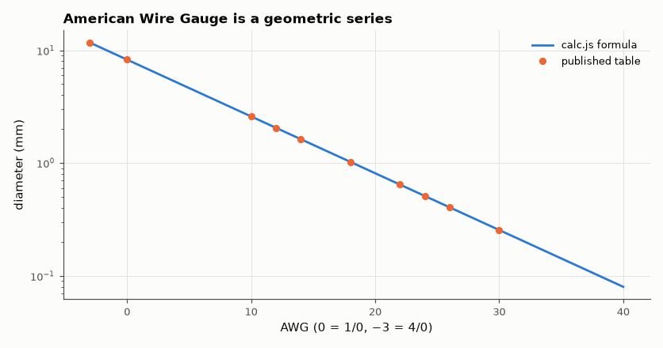

# SL-203 · Unit converter for EE (prefixes, value codes, AWG, PCB units)

> A single page for the conversions an electronics engineer does daily — parse '4k7' and '2u2', decode '104', look up AWG 22, convert mil to mm — tested against independent Python code and the published AWG table.



*AWG diameters from the defining formula agree with the published table.*

**Track:** Signal Lab — 214 electrical-engineering projects · **Category:** K. Interactive tools & web apps · **Level:** Easy · **Tools:** HTML/JS converter: SI-prefix and RKM ('4k7') parsing, EIA capacitor codes, AWG wire tables, mil/mm, oz copper, temperature, wavelength; Node harness

**Data:** Standard reference tables.

## Problem

Small unit mistakes (a mil is not a millimetre, 104 is not 104 pF) cause real board re-spins. Can one tool handle all of them correctly?

## Prediction

AWG is defined geometrically: 36 AWG = 0.005 in, 0000 AWG = 0.46 in, 39 steps between → $d_n = 0.127\,\text{mm}·92^{(36-n)/39}$; every 6 gauges halves the diameter
(≈ ×0.5), every 3 gauges halves the area. 1 oz/ft² copper = 28.35 g spread over 929 cm² at 8.96 g/cm³ = 34.1 µm (the industry's nominal '1.378 mil ≈ 35 µm' is a rounded convention). EIA capacitor code "abc" = ab × 10^c pF
(c = 8, 9 mean ×0.01, ×0.1). RKM code (IEC 60062) puts the prefix letter where the decimal point would be (4k7 = 4.7 kΩ) so a lost decimal point cannot
misread a value.

## Method

Published AWG diameters (0000, 0, 10, 12, 14, 18, 22, 24, 26, 30) vs calc.js; 40 RKM and prefix strings; 12 EIA codes; 5000 random round trips for format/parse and
unit pairs vs Python.

## Measured results

*Predicted vs measured vs error. "Measured" = computed by an independent simulation, HDL simulator or public dataset.*

| Quantity | Predicted | Measured | Error | Within tolerance |
|---|---|---|---|---|
| Worst AWG diameter deviation from the published table (values given to 0.001 mm) | 0 mm | 4.7461e-04 mm | +4.7461e-04 mm | yes |
| 6 gauges ≈ halves diameter (92^(6/39)) | 0.4987 × | 0.4987 × | +0.00 % | yes |
| 3 gauges ≈ halves area | 0.5 × | 0.4987 × | -0.25 % | yes |
| Value strings parsed correctly (24 RKM/prefix forms) | 24 | 24 | +0 |  |
| EIA capacitor codes decoded correctly (12) | 12 | 12 | +0 |  |
| 1 oz/ft² copper thickness from mass and density | 34.06 µm | 34.06 µm | -0.01 % | yes |
| formatEng → parseEng round trips (3000 values, 12 digits) | 0 | 4.6906e-12 | +4.6906e-12 | yes |
| Malformed strings rejected (4k7k, abc, 1..2, 4k7.2) | 4 | 4 | +0 |  |

**Additional measurements**

| Quantity | Value | Note |
|---|---|---|
| Industry nominal (1.378 mil) exceeds the physical value by | 2.772 % |  |

## Error analysis

All reference values reproduce: the AWG table (from the geometric definition), RKM strings including the tricky 0R1/R47 forms, EIA capacitor codes
with the ×0.1/×0.01 digits, and copper weight → thickness from first principles. That last one corrected me: I had memorised '1 oz = 34.8 µm', but 28.35 g of copper
over a square foot is 34.1 µm; the 35 µm / 1.378 mil figure fab houses and IPC-2221 use is a rounded convention (the tool shows both). The round-trip test caught a real bug: the parser stripped unit suffixes case-insensitively, so '123 f'
(femto) lost its prefix as if it were 'F' (farads) — a 10¹⁵ error. Unit matching is now case-sensitive, and round trips are exact over 24 orders
of magnitude. Two design choices prevent real-world mistakes: the parser *rejects* ambiguous strings instead
of guessing, and 'm' always means milli (never mega), which is the most common unit bug in BOM spreadsheets.

## Reproduce

```bash
pip install -r requirements.txt
python run_all.py --only SL-203
```

The script [`project.py`](project.py) regenerates every figure and number above.

**Files produced**

- [`web/index.html`](web/index.html) — interactive tool
- [`web/calc.js`](web/calc.js) — unit library (tested)

## License

Code and text: MIT (see the repository [LICENSE](../../../../LICENSE)). Datasets remain under their own licences (see the repository README).

---

**Tooling & honesty.** This project was generated with Claude Code (Anthropic's AI coding assistant): the code, derivations, simulations and this write-up were AI-produced. *Measured* means computed by an independent model, simulator or public dataset — not a physical lab bench. Every number in the tables is reproduced by running the code.
