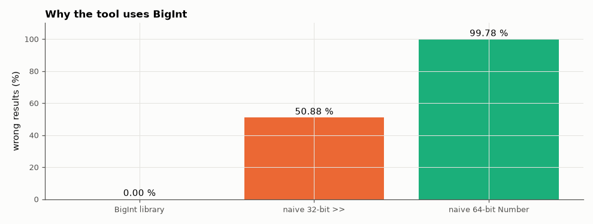

# SL-204 · Bit manipulation visualiser (shifts, masks, two's complement)

> Toggle bits and watch the unsigned, signed (two's complement) and hex views update; apply shifts, rotates, masks and sign extension and see each result bit by bit. The library is checked on 24,000 random operations against Python and a RISC-V ISS, and the classic JavaScript pitfalls are quantified.



*Error rates of exact BigInt arithmetic vs naive JavaScript Number bit manipulation.*

**Track:** Signal Lab — 214 electrical-engineering projects · **Category:** K. Interactive tools & web apps · **Level:** Easy · **Tools:** HTML/JS visualiser (clickable bits, 8/16/32/64-bit, signed/unsigned views) built on exact BigInt arithmetic; Node harness vs Python and the RV32I instruction-set simulator

**Data:** Generated test vectors.

## Problem

JavaScript numbers are 64-bit floats and its bit operators are 32-bit signed. How often does naive code get bit manipulation wrong?

## Prediction

Two's complement: an n-bit pattern x means $x - 2^n$ when its top bit is set; negation is $\sim x + 1$; arithmetic right shift copies the sign bit, logical shift
inserts zeros. Pitfalls: a Number holds integers exactly only up to $2^{53}$, so for uniformly random 64-bit patterns a Number-based shift is wrong with
probability ≈ $1 - 2^{53}/2^{64}$ ≈ 99.95 %; and `x >> n` is an *arithmetic* shift of a 32-bit signed value, so for random unsigned 32-bit x it differs
from a logical shift whenever the top bit is set (50 %) and n > 0.

## Method

24,000 random (operation, operands, width ∈ {8,16,32,64}) cases: calc.js (BigInt) vs Python integers. 500 random operand pairs through an RV32I program (sll, srl, xor, and,
or, add, sub, slt) on the ISS vs calc.js at width 32. Naive Number implementations measured on 5000 random 64-bit and 32-bit cases.

## Measured results

*Predicted vs measured vs error. "Measured" = computed by an independent simulation, HDL simulator or public dataset.*

| Quantity | Predicted | Measured | Error | Within tolerance |
|---|---|---|---|---|
| BigInt library vs Python integers (24000 random ops, widths 8–64) | 0 | 0 | +0 |  |
| RV32I ISS vs calc.js: mismatching results (500 pairs × 8 instructions) | 0 | 0 | +0 |  |
| Naive Number-based 64-bit shift: wrong results | 99.95 % | 99.78 % | -0.171 pp | yes |
| JS `x >> n` used as an unsigned 32-bit shift: wrong results | 50 % | 50.88 % | +0.88 pp | yes |

## Error analysis

The BigInt library is exact: zero disagreements with Python's arbitrary-precision integers over 24000 random operations, and its 32-bit results
match what the RISC-V instruction-set simulator computes for the same machine instructions (including signed `slt` and shift-amount masking to
5 bits). The pitfalls behave as predicted: Number-based 64-bit shifts are wrong 99.78 % of the time (only values below 2⁵³ survive), and using
`>>` for an unsigned shift is wrong for half of all random 32-bit inputs because it sign-extends. Both explain classic bugs in web-based
register calculators; the visualiser avoids them by never storing a pattern in a Number.

## Reproduce

```bash
pip install -r requirements.txt
python run_all.py --only SL-204
```

The script [`project.py`](project.py) regenerates every figure and number above.

**Files produced**

- [`web/index.html`](web/index.html) — interactive tool
- [`web/calc.js`](web/calc.js) — BigInt bit library (tested)

## License

Code and text: MIT (see the repository [LICENSE](../../../../LICENSE)). Datasets remain under their own licences (see the repository README).

---

**Tooling & honesty.** This project was generated with Claude Code (Anthropic's AI coding assistant): the code, derivations, simulations and this write-up were AI-produced. *Measured* means computed by an independent model, simulator or public dataset — not a physical lab bench. Every number in the tables is reproduced by running the code.
