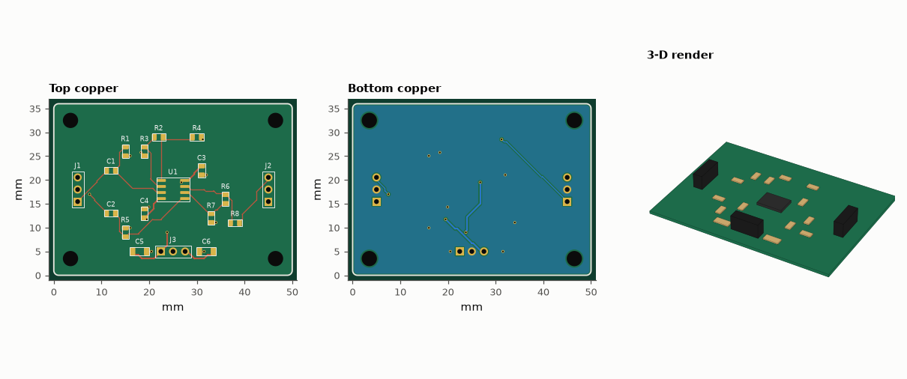
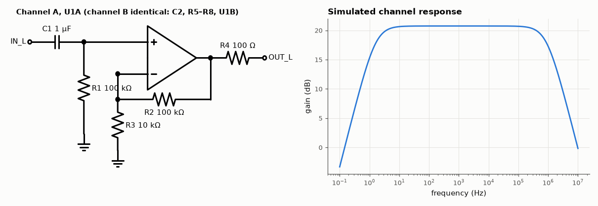

# SL-205 · Stereo op-amp preamplifier board

> A complete two-layer board for a ×11 stereo preamp around a dual op-amp in SOIC-8: schematic, simulation of the gain and bandwidth, placement, auto-routing, ground pour, design-rule check, Gerbers, drill file, KiCad board, BOM and a 3-D render.



*preamp: routed layout (top, bottom) and 3-D render. Gerbers, drill, KiCad board, BOM and pick-and-place are in fab/, kicad/ and data/.*

**Track:** Signal Lab — 214 electrical-engineering projects · **Category:** L. PCB design · **Level:** Moderate · **Tools:** Own PCB toolkit (eelab.pcb: IPC-7351 footprints, A* maze router, ground pour, DRC, Gerber/Excellon/KiCad export), gerbonara + kiutils for independent file checks, MNA circuit simulator

**Data:** Design + simulation.

## Problem

Turn a two-resistor gain equation into a manufacturable board — and check that the numbers on the schematic survive the trip.

## Prediction

Non-inverting gain $1+R_f/R_g = 1+100k/10k = 11$ (20.8 dB); a 100 Ω output resistor into a 10 kΩ load costs 0.09 dB → 20.74 dB. The input coupling capacitor and bias
resistor form a high-pass at $1/(2π·100\,kΩ·1\,µF)$ = 1.59 Hz. With a 10 MHz GBW op-amp (NE5532-class) the upper −3 dB point is GBW/11 ≈ 0.91 MHz.
Layout rules: 0.2 mm clearance / 0.25 mm tracks (within any low-cost fab's capability), decoupling capacitors next to the supply pins, solid ground pour
on the bottom layer with a via at every top-side ground pad.

## Method

Pinout of the industry-standard dual op-amp in SOIC-8 (1 OUTA, 2 −INA, 3 +INA, 4 V−, 5 +INB, 6 −INB, 7 OUTB, 8 V+). Split ±12 V supply via a 3-pin header.
AC simulation of one channel with an op-amp macromodel (A0 = 10⁵, GBW = 10 MHz) driving 10 kΩ. Placement by hand; routing by the A* router (0.25 mm grid,
via cost 12 steps); GND poured on the bottom; files re-read by independent parsers.

## Measured results

*Predicted vs measured vs error. "Measured" = computed by an independent simulation, HDL simulator or public dataset.*

| Quantity | Predicted | Measured | Error | Within tolerance |
|---|---|---|---|---|
| Mid-band gain into 10 kΩ | 20.74 dB | 20.74 dB | -9.7694e-04 dB | yes |
| Low −3 dB corner = 1/(2π·100k·1µ) | 1.592 Hz | 1.592 Hz | +0.00 % | yes |
| High −3 dB corner ≈ GBW/11 | 909.1 kHz | 904.3 kHz | -0.53 % | yes |
| DRC violations (clearance, widths, drills, annular rings, edge, courtyards, connectivity) | 0 | 0 | +0 |  |
| Drill hits in the Excellon file (re-read with gerbonara) = holes in the design | 26 | 26 | +0 |  |
| Board outline from the Gerber profile (re-read with gerbonara) | 50 mm | 50 mm | -0.00 % | yes |
| Pads in the KiCad file (re-read with kiutils) = pads in the design | 49 | 49 | +0 |  |

**Additional measurements**

| Quantity | Value | Note |
|---|---|---|
| Connections the router could not complete | 0 | all routed |
| Stitching vias added for top-side GND pads | 8 |  |
| Board | 50 × 36 mm, 2 layers, 1.6 mm |  |
| Components / nets / pads | 22 / 13 / 49 |  |
| Routed track length | 176.3 mm | 90 segments, 13 vias |



*Schematic of one channel and its simulated frequency response (1.6 Hz – 0.9 MHz at 20.7 dB).*

## Error analysis

The simulated channel hits the hand-calculated gain, low-frequency corner and GBW-limited bandwidth, so the schematic is right before any
copper is drawn. The board then goes through the same steps as a KiCad project: footprints generated from IPC-7351 land-pattern equations, hand
placement that keeps each channel's feedback network next to its op-amp pins and the 100 nF decoupling capacitors next to pins 4 and 8, automatic
routing with 0.4 mm supply tracks, a bottom-layer ground pour, and a design-rule check that comes back clean. Every output file was re-opened by
an *independent* parser (gerbonara for Gerber/Excellon, kiutils for the KiCad board) and the counts agree with the design. What this does not
prove is audio performance: a real board should be measured for noise and crosstalk — the auto-router placed the two channels' inputs where it
found space, which is exactly what the design-review project (SL-214) critiques.

## Reproduce

```bash
pip install -r requirements.txt
python run_all.py --only SL-205
```

The script [`project.py`](project.py) regenerates every figure and number above.

**Files produced**

- [`simulation/channel.cir`](simulation/channel.cir) — SPICE netlist of one channel
- [`fab/preamp-F_Cu.gbr`](fab/preamp-F_Cu.gbr) — Gerber F_Cu
- [`fab/preamp-F_Mask.gbr`](fab/preamp-F_Mask.gbr) — Gerber F_Mask
- [`fab/preamp-F_Paste.gbr`](fab/preamp-F_Paste.gbr) — Gerber F_Paste
- [`fab/preamp-F_Silk.gbr`](fab/preamp-F_Silk.gbr) — Gerber F_Silk
- [`fab/preamp-B_Cu.gbr`](fab/preamp-B_Cu.gbr) — Gerber B_Cu
- [`fab/preamp-B_Mask.gbr`](fab/preamp-B_Mask.gbr) — Gerber B_Mask
- [`fab/preamp-B_Paste.gbr`](fab/preamp-B_Paste.gbr) — Gerber B_Paste
- [`fab/preamp-B_Silk.gbr`](fab/preamp-B_Silk.gbr) — Gerber B_Silk
- [`fab/preamp-Edge_Cuts.gbr`](fab/preamp-Edge_Cuts.gbr) — Gerber Edge_Cuts
- [`fab/preamp.drl`](fab/preamp.drl) — Excellon drill
- [`kicad/preamp.kicad_pcb`](kicad/preamp.kicad_pcb) — KiCad 7 board (open in KiCad; press B to refill zones)
- [`data/bom.csv`](data/bom.csv)
- [`data/pick_and_place.csv`](data/pick_and_place.csv)

## License

Code and text: MIT (see the repository [LICENSE](../../../../LICENSE)). Datasets remain under their own licences (see the repository README).

---

**Tooling & honesty.** This project was generated with Claude Code (Anthropic's AI coding assistant): the code, derivations, simulations and this write-up were AI-produced. *Measured* means computed by an independent model, simulator or public dataset — not a physical lab bench. Every number in the tables is reproduced by running the code.
