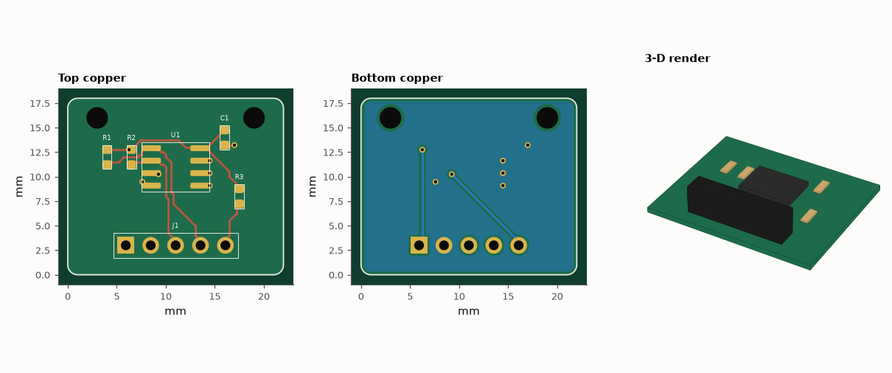
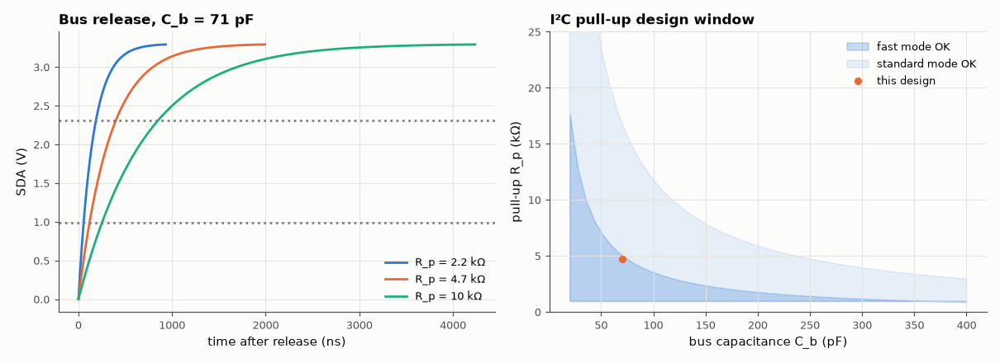

# SL-206 · I²C temperature-sensor breakout board

> A small, clean breakout for an LM75-class I²C temperature sensor (SOIC-8) with pull-ups, decoupling and a 5-pin header. The routed board's own trace capacitance feeds an I²C rise-time budget, checked by simulating the open-drain bus.



*i2c_temp_breakout: routed layout (top, bottom) and 3-D render. Gerbers, drill, KiCad board, BOM and pick-and-place are in fab/, kicad/ and data/.*

**Track:** Signal Lab — 214 electrical-engineering projects · **Category:** L. PCB design · **Level:** Moderate · **Tools:** eelab.pcb (footprints, router, pour, DRC, Gerber/KiCad export), microstrip capacitance from the routed geometry, MNA transient simulation of the open-drain bus

**Data:** Design + simulation.

## Problem

Which pull-up resistor does an I²C breakout need — and does the board itself matter?

## Prediction

An open-drain line rises through R_p into the bus capacitance C_b; the I²C rise time (30 %→70 % of V_DD) is $t_r = \ln(0.7/0.3)\,R_pC_b = 0.8473\,R_pC_b$. Limits:
$t_r$ ≤ 1000 ns (standard mode, 100 kHz) or ≤ 300 ns (fast mode, 400 kHz), and $R_p ≥ (V_{DD}-0.4\,V)/3\,\text{mA}$ so a device can pull the line low.
The breakout's own contribution is its trace capacitance: for a 0.25 mm trace over a 1.6 mm board with a ground pour below, ≈ 0.05 pF/mm, i.e. a few pF —
small next to device pins (~10 pF each) and wiring (tens of pF).

## Method

LM75-style pinout (1 SDA, 2 SCL, 3 OS, 4 GND, 5–7 A2–A0, 8 V+), address pins strapped to GND (0x48). 4.7 kΩ pull-ups, 10 kΩ on OS, 100 nF decoupling.
C_b = routed SDA length × microstrip C′ (Hammerstad–Jensen, ε_r 4.4) + 10 pF sensor pin + 10 pF controller pin + 50 pF wiring (assumed jumper wires).
Transient: MNA simulation of R_p charging C_b when the open-drain driver (switch, 20 Ω on) releases.

## Measured results

*Predicted vs measured vs error. "Measured" = computed by an independent simulation, HDL simulator or public dataset.*

| Quantity | Predicted | Measured | Error | Within tolerance |
|---|---|---|---|---|
| DRC violations (clearance, widths, drills, annular rings, edge, courtyards, connectivity) | 0 | 0 | +0 |  |
| Drill hits in the Excellon file (re-read with gerbonara) = holes in the design | 14 | 14 | +0 |  |
| Board outline from the Gerber profile (re-read with gerbonara) | 22 mm | 22 mm | +0.00 % | yes |
| Pads in the KiCad file (re-read with kiutils) = pads in the design | 23 | 23 | +0 |  |
| Microstrip capacitance per mm of 0.25 mm track over the pour (my guess ≈ 0.05 pF/mm) | 0.05 pF/mm | 0.04085 pF/mm | -0.009147 pF/mm | yes |
| SDA rise time with 4.7 kΩ (0.8473·Rp·Cb) | 281.2 ns | 281.2 ns | +0.00 % | yes |
| 4.7 kΩ meets fast-mode 300 ns? (1 = yes) | 1 | 1 | +0 |  |

**Additional measurements**

| Quantity | Value | Note |
|---|---|---|
| Unrouted connections | 0 |  |
| Board | 22 × 18 mm, 2 layers, 1.6 mm |  |
| Components / nets / pads | 8 / 5 / 23 |  |
| Routed track length | 66.97 mm | 47 segments, 7 vias |
| Routed SDA length on the breakout | 15.11 mm |  |
| SDA trace capacitance of the breakout | 0.6175 pF |  |
| Allowed pull-up range, standard mode (100 kHz) | 967 Ω – 16.7 kΩ |  |
| Allowed pull-up range, fast mode (400 kHz) | 967 Ω – 5.01 kΩ |  |



*Open-drain rise for three pull-ups (simulated) and the allowed pull-up window vs bus capacitance.*

## Error analysis

The breakout routes cleanly on two layers with a ground pour, and the numbers show why its layout barely matters for I²C timing: the whole
SDA trace is 15 mm long and adds only 0.6 pF, compared with ~20 pF of device pins and ~50 pF of jumper wiring. With 4.7 kΩ
pull-ups the simulated rise time is 281 ns, matching 0.8473·R_pC_b — comfortably inside standard mode, and
inside fast mode's 300 ns. The design window plot is the practical takeaway: breakouts ship with pull-ups, and when
several are wired in parallel the pull-ups combine (three 4.7 kΩ ≈ 1.6 kΩ), creeping toward the 967 Ω minimum at 3.3 V — which is why good
breakouts put the pull-ups behind solder jumpers. The first placement put C1's courtyard over a mounting hole — the DRC flagged it and C1 moved 1.5 mm. The 50 pF wiring figure is an assumption; measure your own bus with a scope if it is long.

## Reproduce

```bash
pip install -r requirements.txt
python run_all.py --only SL-206
```

The script [`project.py`](project.py) regenerates every figure and number above.

**Files produced**

- [`fab/i2c_temp_breakout-F_Cu.gbr`](fab/i2c_temp_breakout-F_Cu.gbr) — Gerber F_Cu
- [`fab/i2c_temp_breakout-F_Mask.gbr`](fab/i2c_temp_breakout-F_Mask.gbr) — Gerber F_Mask
- [`fab/i2c_temp_breakout-F_Paste.gbr`](fab/i2c_temp_breakout-F_Paste.gbr) — Gerber F_Paste
- [`fab/i2c_temp_breakout-F_Silk.gbr`](fab/i2c_temp_breakout-F_Silk.gbr) — Gerber F_Silk
- [`fab/i2c_temp_breakout-B_Cu.gbr`](fab/i2c_temp_breakout-B_Cu.gbr) — Gerber B_Cu
- [`fab/i2c_temp_breakout-B_Mask.gbr`](fab/i2c_temp_breakout-B_Mask.gbr) — Gerber B_Mask
- [`fab/i2c_temp_breakout-B_Paste.gbr`](fab/i2c_temp_breakout-B_Paste.gbr) — Gerber B_Paste
- [`fab/i2c_temp_breakout-B_Silk.gbr`](fab/i2c_temp_breakout-B_Silk.gbr) — Gerber B_Silk
- [`fab/i2c_temp_breakout-Edge_Cuts.gbr`](fab/i2c_temp_breakout-Edge_Cuts.gbr) — Gerber Edge_Cuts
- [`fab/i2c_temp_breakout.drl`](fab/i2c_temp_breakout.drl) — Excellon drill
- [`kicad/i2c_temp_breakout.kicad_pcb`](kicad/i2c_temp_breakout.kicad_pcb) — KiCad 7 board (open in KiCad; press B to refill zones)
- [`data/bom.csv`](data/bom.csv)
- [`data/pick_and_place.csv`](data/pick_and_place.csv)

## License

Code and text: MIT (see the repository [LICENSE](../../../../LICENSE)). Datasets remain under their own licences (see the repository README).

---

**Tooling & honesty.** This project was generated with Claude Code (Anthropic's AI coding assistant): the code, derivations, simulations and this write-up were AI-produced. *Measured* means computed by an independent model, simulator or public dataset — not a physical lab bench. Every number in the tables is reproduced by running the code.
