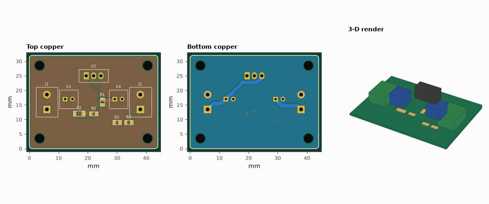
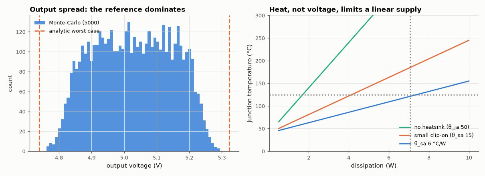

# SL-207 · Linear power-supply board (LM317, 12 V → 5 V, 1 A)

> An adjustable-regulator board delivering 5 V at up to 1 A: resistor selection from E96, a Monte-Carlo of output voltage over part tolerances, a junction-temperature budget that sizes the heatsink, IPC-2221 track widths and the routed copper's voltage drop.



*lm317_5v_psu: routed layout (top, bottom) and 3-D render. Gerbers, drill, KiCad board, BOM and pick-and-place are in fab/, kicad/ and data/.*

**Track:** Signal Lab — 214 electrical-engineering projects · **Category:** L. PCB design · **Level:** Moderate · **Tools:** eelab.pcb with IPC-2221 track widths and wide power routing, tolerance Monte-Carlo on the MNA simulator, thermal budget, DRC and fab outputs

**Data:** Design + simulation (datasheet-typical LM317 parameters).

## Problem

A linear regulator is a three-pin part — so where do the real design decisions lie? Answer: tolerance, heat and copper.

## Prediction

$V_\text{out}=V_\text{ref}(1+R_2/R_1)+I_\text{adj}R_2$ with $V_\text{ref}$ = 1.25 V (1.20–1.30 V), $I_\text{adj}$ ≈ 50 µA (≤ 100 µA). With R1 = 240 Ω, 5.00 V needs R2 = 713 Ω → E96 715 Ω → 5.01 V
nominal. Worst case (±4 % reference, ±1 % resistors, I_adj 50–100 µA) spans ≈ 4.74–5.32 V — the reference dominates. Heat: P ≈ (12 − 5) V × 1 A = 7 W; with θ_ja ≈ 50 °C/W
(no heatsink) T_j would be ~390 °C, so a heatsink of θ_sa ≤ (125 − 40)/7 − θ_jc − θ_cs ≈ 6.6 °C/W is required at 40 °C ambient. Copper: IPC-2221 gives
0.30 mm for 1 A at 10 °C rise on 1 oz outer layers; 1.5 mm tracks cut the IR drop to a few mV per cm.

## Method

Regulator as a behavioural model (high-gain error amplifier holding OUT − ADJ = V_ref, I_adj into ADJ) in the MNA simulator; 5000 Monte-Carlo draws: V_ref uniform 1.20–1.30 V, resistors
uniform ±1 %, I_adj uniform 50–100 µA. Board: 2-pin terminal blocks, TO-220 (1 ADJ, 2 OUT, 3 IN), input/output 10 µF electrolytics, 10 µF ADJ bypass,
power LED; power nets routed at 1.5 mm, GND poured on both layers.

## Measured results

*Predicted vs measured vs error. "Measured" = computed by an independent simulation, HDL simulator or public dataset.*

| Quantity | Predicted | Measured | Error | Within tolerance |
|---|---|---|---|---|
| Nominal output with E96 parts | 5.01 V | 5.01 V | -0.00 % | yes |
| Worst-case low output (analytic) vs Monte-Carlo minimum | 4.74 V | 4.762 V | +0.46 % | yes |
| Worst-case high output (analytic) vs Monte-Carlo maximum | 5.323 V | 5.294 V | -0.55 % | yes |
| IPC-2221 minimum width for 1 A, 10 °C rise, 1 oz outer | 0.3 mm | 0.3004 mm | +0.13 % | yes |
| DRC violations (clearance, widths, drills, annular rings, edge, courtyards, connectivity) | 0 | 0 | +0 |  |
| Drill hits in the Excellon file (re-read with gerbonara) = holes in the design | 18 | 18 | +0 |  |
| Board outline from the Gerber profile (re-read with gerbonara) | 44 mm | 44 mm | -0.00 % | yes |
| Pads in the KiCad file (re-read with kiutils) = pads in the design | 25 | 25 | +0 |  |
| IR drop in VOUT copper at 1 A (≤ 10 mV target) | 10 mV | 7.033 mV | -2.967 mV | yes |

**Additional measurements**

| Quantity | Value | Note |
|---|---|---|
| Ideal R2 for 5.00 V | 713.2 Ω | E96 choice: 715 Ω |
| Share of output variance from V_ref alone | 91.5 % |  |
| Regulator dissipation at 1 A | 7.06 W |  |
| T_j with no heatsink (θ_ja ≈ 50 °C/W, 40 °C ambient) | 393 °C | — impossible: thermal shutdown |
| Required heatsink θ_sa (θ_jc 5, θ_cs 0.5 °C/W, T_j ≤ 125 °C) | 6.54 °C/W |  |
| Unrouted connections | 0 |  |
| Board | 44 × 32 mm, 2 layers, 1.6 mm |  |
| Components / nets / pads | 14 / 5 / 25 |  |
| Routed track length | 64.77 mm | 51 segments, 3 vias |
| Routed VOUT copper length / resistance | 21.5 mm / 7.03 mΩ |  |



*Output-voltage distribution vs analytic bounds, and junction temperature vs dissipation for three thermal paths.*

## Error analysis

The E96 resistor pair lands the nominal output at 5.01 V, but the Monte-Carlo shows the part-to-part spread is 4.8–5.3 V, almost all of it
(92 % of the variance) from the ±4 % reference — spending money on 0.1 % resistors would not help; a trim or a better regulator
would. The analytic worst case bounds the Monte-Carlo, as it must. Heat is the real constraint: at 1 A from 12 V the regulator burns 7 W, which
needs a ≲ 6.5 °C/W heatsink; without one the part would hit thermal shutdown within seconds. On the board, power paths are
routed at 1.5 mm (5× the IPC-2221 minimum) so the output copper drops only 7.0 mV at 1 A, both layers carry ground pours, and the ADJ
bypass capacitor sits beside the ADJ pin. A switching regulator would cut the 7 W to under 1 W — the linear design is chosen here for its low noise
and simplicity, and the board makes its cost visible. Two first-attempt errors are worth recording: my first regulator model was a floating 1.25 V source,
which cannot deliver load current to ground (it 'regulated' to 9 mV), and the first placement put both electrolytics' courtyards on top of the
terminal blocks — the DRC caught it.

## Reproduce

```bash
pip install -r requirements.txt
python run_all.py --only SL-207
```

The script [`project.py`](project.py) regenerates every figure and number above.

**Files produced**

- [`fab/lm317_5v_psu-F_Cu.gbr`](fab/lm317_5v_psu-F_Cu.gbr) — Gerber F_Cu
- [`fab/lm317_5v_psu-F_Mask.gbr`](fab/lm317_5v_psu-F_Mask.gbr) — Gerber F_Mask
- [`fab/lm317_5v_psu-F_Paste.gbr`](fab/lm317_5v_psu-F_Paste.gbr) — Gerber F_Paste
- [`fab/lm317_5v_psu-F_Silk.gbr`](fab/lm317_5v_psu-F_Silk.gbr) — Gerber F_Silk
- [`fab/lm317_5v_psu-B_Cu.gbr`](fab/lm317_5v_psu-B_Cu.gbr) — Gerber B_Cu
- [`fab/lm317_5v_psu-B_Mask.gbr`](fab/lm317_5v_psu-B_Mask.gbr) — Gerber B_Mask
- [`fab/lm317_5v_psu-B_Paste.gbr`](fab/lm317_5v_psu-B_Paste.gbr) — Gerber B_Paste
- [`fab/lm317_5v_psu-B_Silk.gbr`](fab/lm317_5v_psu-B_Silk.gbr) — Gerber B_Silk
- [`fab/lm317_5v_psu-Edge_Cuts.gbr`](fab/lm317_5v_psu-Edge_Cuts.gbr) — Gerber Edge_Cuts
- [`fab/lm317_5v_psu.drl`](fab/lm317_5v_psu.drl) — Excellon drill
- [`kicad/lm317_5v_psu.kicad_pcb`](kicad/lm317_5v_psu.kicad_pcb) — KiCad 7 board (open in KiCad; press B to refill zones)
- [`data/bom.csv`](data/bom.csv)
- [`data/pick_and_place.csv`](data/pick_and_place.csv)

## License

Code and text: MIT (see the repository [LICENSE](../../../../LICENSE)). Datasets remain under their own licences (see the repository README).

---

**Tooling & honesty.** This project was generated with Claude Code (Anthropic's AI coding assistant): the code, derivations, simulations and this write-up were AI-produced. *Measured* means computed by an independent model, simulator or public dataset — not a physical lab bench. Every number in the tables is reproduced by running the code.
