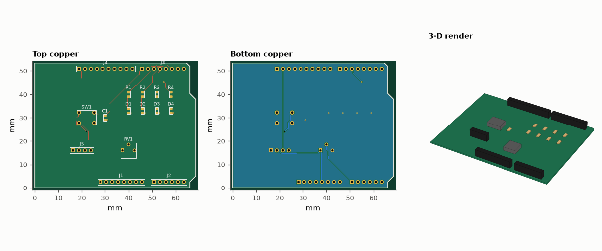
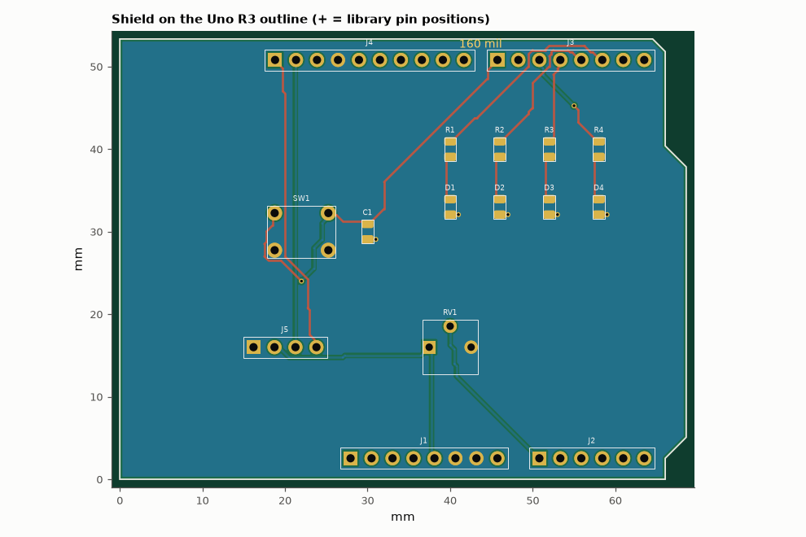

# SL-208 · Arduino Uno R3 shield (LEDs, button, potentiometer, I²C port)

> A shield laid out on the Uno R3's real header coordinates — including the famous 160-mil offset between D7 and D8 — carrying four LEDs, a push-button, a potentiometer and a Qwiic-style I²C header; LED currents and the pin current budget are simulated.



*uno_shield: routed layout (top, bottom) and 3-D render. Gerbers, drill, KiCad board, BOM and pick-and-place are in fab/, kicad/ and data/.*

**Track:** Signal Lab — 214 electrical-engineering projects · **Category:** L. PCB design · **Level:** Moderate · **Tools:** Uno R3 mechanical data parsed from the official KiCad footprint library (kiutils), eelab.pcb router/DRC/exports, MNA simulation of the LED drive

**Data:** Real mechanical data: KiCad footprint library (CC-BY-SA 4.0 with exception).

## Problem

Designing to a standard mechanical footprint means getting someone else's dimensions exactly right. How do you avoid measuring by hand?

## Prediction

The Uno's header rows are on a 100-mil grid except for one quirk: the gap between D7 and D8 is 160 mil (4.064 mm), which stops shields being plugged in
offset by one pin. The LED current is $(V_{OH}-V_f)/(R+R_\text{pin})$: with a 330 Ω resistor, V_f ≈ 2.0 V and an output driver of ~40 Ω, ≈ 8.1 mA per LED — well under
the 20 mA recommended per pin; four LEDs draw ≈ 32 mA. The button uses the internal pull-up (20–50 kΩ) with a 100 nF capacitor: τ ≈ 3.5 ms of debouncing.

## Method

Pad positions of all 32 header pins and the board outline read from KiCad's `Module.pretty/Arduino_UNO_R3.kicad_mod` (fetched from the KiCad GitLab) and interpreted in
this toolkit's y-up frame (USB side at the left, digital header along the top). LEDs on D2–D5 (0805 + 330 Ω), button on D7 to GND with 100 nF, 10 kΩ
trimmer on A0, 4-pin I²C header on SDA/SCL. LED drive simulated with a diode model fitted to V_f = 2.0 V at 10 mA and a 40 Ω pin resistance (assumed).

## Measured results

*Predicted vs measured vs error. "Measured" = computed by an independent simulation, HDL simulator or public dataset.*

| Quantity | Predicted | Measured | Error | Within tolerance |
|---|---|---|---|---|
| D7 → D8 pin spacing from the KiCad library (the 160-mil quirk) | 4.064 mm | 4.06 mm | -0.10 % | yes |
| Power-header → analog-header spacing (VIN → A0) | 5.08 mm | 5.08 mm | -0.00 % | yes |
| Distance between the two header rows | 48.26 mm | 48.26 mm | +0.00 % | yes |
| Board length (outline in the library) = 2.7 in | 68.58 mm | 68.58 mm | +0.00 % | yes |
| Board width = 2.1 in | 53.34 mm | 53.34 mm | +0.00 % | yes |
| DRC violations (clearance, widths, drills, annular rings, edge, courtyards, connectivity) | 0 | 0 | +0 |  |
| Drill hits in the Excellon file (re-read with gerbonara) = holes in the design | 50 | 50 | +0 |  |
| Board outline from the Gerber profile (re-read with gerbonara) | 68.58 mm | 68.58 mm | +0.00 % | yes |
| Pads in the KiCad file (re-read with kiutils) = pads in the design | 61 | 61 | +0 |  |
| LED current, 330 Ω + 40 Ω pin (formula with V_f = 2.0 V) | 8.108 mA | 8.137 mA | +0.36 % | yes |
| Total for 4 LEDs vs 200 mA package limit (fraction) | 0.16 | 0.1627 | +0.002738 | yes |

**Additional measurements**

| Quantity | Value | Note |
|---|---|---|
| Pins off the 100-mil grid of pin 1 (all of D8–SCL) | 10 |  |
| Unrouted connections | 0 |  |
| Board | 68.58 × 53.34 mm, 2 layers, 1.6 mm |  |
| Components / nets / pads | 16 / 33 / 61 |  |
| Routed track length | 247.7 mm | 87 segments, 7 vias |
| Simulated LED forward voltage | 1.989 V |  |
| Button debounce τ with 35 kΩ internal pull-up and 100 nF | 3.5 ms |  |



*The shield's headers sit exactly on the pin positions from the KiCad library, including the 160-mil D7–D8 offset.*

## Error analysis

Taking the mechanical data from the maintained KiCad library instead of a ruler removes the classic shield mistake: every header pin lands on
the library position, the D7→D8 spacing comes out at exactly 4.060 mm (160 mil) and the outline at 2.7 × 2.1 in with the Uno's chamfered corner.
A caution on orientation: KiCad's y axis points down; I interpret the library coordinates in a y-up frame, which gives the familiar top view
(USB side left, digital header along the top, D0 at the right end), and the KiCad exporter flips y back. Before ordering boards, print the top
copper 1:1 and lay it on a real Uno — the cheapest DRC there is. The Uno's four mounting holes are not in this footprint, so the shield has none;
add them from Arduino's official drawing if the shield must be bolted down. Electrically, the LEDs draw 8.1 mA each (simulated with a
diode fitted to 2.0 V at 10 mA and an assumed 40 Ω driver), 33 mA in total — comfortably inside the ATmega328P's limits.

## Reproduce

```bash
pip install -r requirements.txt
python run_all.py --only SL-208
```

The script [`project.py`](project.py) regenerates every figure and number above.

**Files produced**

- [`fab/uno_shield-F_Cu.gbr`](fab/uno_shield-F_Cu.gbr) — Gerber F_Cu
- [`fab/uno_shield-F_Mask.gbr`](fab/uno_shield-F_Mask.gbr) — Gerber F_Mask
- [`fab/uno_shield-F_Paste.gbr`](fab/uno_shield-F_Paste.gbr) — Gerber F_Paste
- [`fab/uno_shield-F_Silk.gbr`](fab/uno_shield-F_Silk.gbr) — Gerber F_Silk
- [`fab/uno_shield-B_Cu.gbr`](fab/uno_shield-B_Cu.gbr) — Gerber B_Cu
- [`fab/uno_shield-B_Mask.gbr`](fab/uno_shield-B_Mask.gbr) — Gerber B_Mask
- [`fab/uno_shield-B_Paste.gbr`](fab/uno_shield-B_Paste.gbr) — Gerber B_Paste
- [`fab/uno_shield-B_Silk.gbr`](fab/uno_shield-B_Silk.gbr) — Gerber B_Silk
- [`fab/uno_shield-Edge_Cuts.gbr`](fab/uno_shield-Edge_Cuts.gbr) — Gerber Edge_Cuts
- [`fab/uno_shield.drl`](fab/uno_shield.drl) — Excellon drill
- [`kicad/uno_shield.kicad_pcb`](kicad/uno_shield.kicad_pcb) — KiCad 7 board (open in KiCad; press B to refill zones)
- [`data/bom.csv`](data/bom.csv)
- [`data/pick_and_place.csv`](data/pick_and_place.csv)

## License

Code and text: MIT (see the repository [LICENSE](../../../../LICENSE)). Datasets remain under their own licences (see the repository README).

---

**Tooling & honesty.** This project was generated with Claude Code (Anthropic's AI coding assistant): the code, derivations, simulations and this write-up were AI-produced. *Measured* means computed by an independent model, simulator or public dataset — not a physical lab bench. Every number in the tables is reproduced by running the code.
