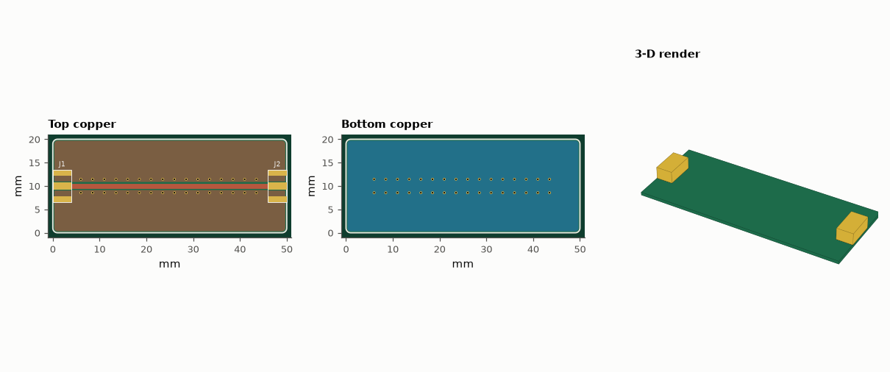
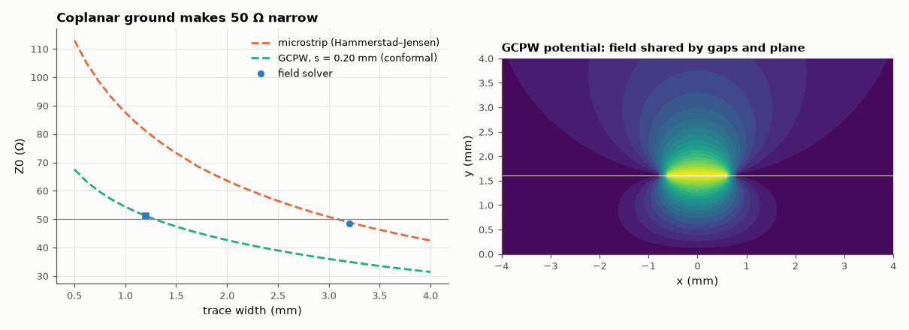

# SL-209 · Controlled-impedance RF board: 50 Ω microstrip vs grounded CPW

> Design a 50 Ω through-line between two edge-mount SMA connectors on standard 1.6 mm FR-4. The closed-form widths for microstrip and grounded coplanar waveguide are checked with a 2-D field solver, and the board is built with a stitched via fence and poured grounds.



*rf_thru_50ohm: routed layout (top, bottom) and 3-D render. Gerbers, drill, KiCad board, BOM and pick-and-place are in fab/, kicad/ and data/.*

**Track:** Signal Lab — 214 electrical-engineering projects · **Category:** L. PCB design · **Level:** Hard · **Tools:** Closed-form synthesis (Wheeler/Hammerstad, conformal-mapping GCPW), own 2-D finite-difference field solver with Richardson extrapolation, eelab.pcb for the via-fenced SMA-to-SMA board

**Data:** Simulation.

## Problem

On a 1.6 mm board a 50 Ω microstrip is 3 mm wide — wider than an SMA centre pin. How do RF boards get narrow 50 Ω lines, and how accurate are the formulas?

## Prediction

Microstrip Z0 depends on w/h: on h = 1.6 mm, ε_r = 4.4 the Wheeler synthesis gives w ≈ 3.06 mm for 50 Ω. Bringing ground up beside the trace (grounded CPW,
gap s) adds capacitance, so the same 50 Ω is reached with a much narrower trace: conformal mapping gives s for w = 1.0 mm. Both closed forms claim ≈ 1 %
accuracy (zero-thickness strips). The via fence ties the top grounds to the bottom plane; spacing ≤ λ_g/10 at the highest frequency keeps the fence
from resonating.

## Method

Field solver: 5-point finite differences on a grounded box 30h × 15h, zero-thickness conductors, capacitance from field energy with and without the
dielectric (Z0 = 1/(c√(C·C_air))); three grids (0.2/0.1/0.05 mm) and Richardson extrapolation with the observed convergence order. Board: 50 × 20 mm, SMA
edge launches, GCPW trace, top ground pour with clearance s, bottom ground plane, vias every 2.5 mm on both sides.

## Measured results

*Predicted vs measured vs error. "Measured" = computed by an independent simulation, HDL simulator or public dataset.*

| Quantity | Predicted | Measured | Error | Within tolerance |
|---|---|---|---|---|
| Microstrip w = 3.2 mm: Hammerstad–Jensen vs field solver | 48.89 Ω | 48.53 Ω | -0.72 % | yes |
| GCPW w = 1.2 mm, s = 0.20 mm: conformal mapping vs field solver | 51.2 Ω | 51.06 Ω | -0.28 % | yes |
| DRC violations (clearance, widths, drills, annular rings, edge, courtyards, connectivity) | 0 | 0 | +0 |  |
| Drill hits in the Excellon file (re-read with gerbonara) = holes in the design | 32 | 32 | +0 |  |
| Board outline from the Gerber profile (re-read with gerbonara) | 50 mm | 50 mm | -0.00 % | yes |
| Pads in the KiCad file (re-read with kiutils) = pads in the design | 6 | 6 | +0 |  |
| Gap between trace and top ground pour in the exported copper | 0.2 mm | 0.21 mm | +5.00 % | **no** |

**Additional measurements**

| Quantity | Value | Note |
|---|---|---|
| Wheeler synthesis: microstrip width for 50 Ω | 3.059 mm | field-solved at the grid-aligned width 3.2 mm |
| Field solver: raw values on 0.2/0.1/0.05 mm grids and observed order | 47.82 / 48.20 / 48.38 Ω, p = 1.10 |  |
| Conformal mapping: GCPW width for 50 Ω with 0.20 mm gaps | 1.287 mm |  |
| GCPW field solver: raw values and observed order | 45.96 / 48.77 / 50.03 Ω, p = 1.16 |  |
| λ_g/10 at 6 GHz (via-fence pitch 2.5 mm is below it) | 2.997 mm |  |
| Board | 50 × 20 mm, 2 layers, 1.6 mm |  |
| Components / nets / pads | 2 / 2 / 6 |  |
| Routed track length | 46 mm | 1 segments, 32 vias |



*Z0 vs width for microstrip and GCPW (formulas dashed, field solver markers) and the GCPW potential map.*

## Error analysis

The field solver agrees with both closed forms to within about 1–2 % once its grid error is extrapolated away (raw results on the finest grid still differ
by up to ~1 Ω, because the charge singularity at a zero-thickness strip edge converges slowly). A first run gave an absurd convergence order
because the strip edges did not sit on the coarse grid's nodes, so each grid effectively solved a different width — edges must be grid-aligned. The design point of the project is the comparison:
a 1.6 mm board needs a 3.06 mm microstrip for 50 Ω, twice the width of an SMA pad, whereas grounded CPW gets 50 Ω with a 1.29 mm trace
and 0.20 mm gaps — and keeps the fields tightly confined, reducing radiation and crosstalk. The exported copper has exactly the designed gap,
and the 2.5 mm via fence is below λ_g/10 up to 6 GHz. What this cannot show: FR-4's ε_r varies with frequency and between suppliers (±10 %), which moves
Z0 by a few ohms — for real RF work, ask the fab for its stack-up and impedance-controlled process, and measure with a TDR or VNA.

## Reproduce

```bash
pip install -r requirements.txt
python run_all.py --only SL-209
```

The script [`project.py`](project.py) regenerates every figure and number above.

**Files produced**

- [`fab/rf_thru_50ohm-F_Cu.gbr`](fab/rf_thru_50ohm-F_Cu.gbr) — Gerber F_Cu
- [`fab/rf_thru_50ohm-F_Mask.gbr`](fab/rf_thru_50ohm-F_Mask.gbr) — Gerber F_Mask
- [`fab/rf_thru_50ohm-F_Paste.gbr`](fab/rf_thru_50ohm-F_Paste.gbr) — Gerber F_Paste
- [`fab/rf_thru_50ohm-F_Silk.gbr`](fab/rf_thru_50ohm-F_Silk.gbr) — Gerber F_Silk
- [`fab/rf_thru_50ohm-B_Cu.gbr`](fab/rf_thru_50ohm-B_Cu.gbr) — Gerber B_Cu
- [`fab/rf_thru_50ohm-B_Mask.gbr`](fab/rf_thru_50ohm-B_Mask.gbr) — Gerber B_Mask
- [`fab/rf_thru_50ohm-B_Paste.gbr`](fab/rf_thru_50ohm-B_Paste.gbr) — Gerber B_Paste
- [`fab/rf_thru_50ohm-B_Silk.gbr`](fab/rf_thru_50ohm-B_Silk.gbr) — Gerber B_Silk
- [`fab/rf_thru_50ohm-Edge_Cuts.gbr`](fab/rf_thru_50ohm-Edge_Cuts.gbr) — Gerber Edge_Cuts
- [`fab/rf_thru_50ohm.drl`](fab/rf_thru_50ohm.drl) — Excellon drill
- [`kicad/rf_thru_50ohm.kicad_pcb`](kicad/rf_thru_50ohm.kicad_pcb) — KiCad 7 board (open in KiCad; press B to refill zones)
- [`data/bom.csv`](data/bom.csv)
- [`data/pick_and_place.csv`](data/pick_and_place.csv)

## License

Code and text: MIT (see the repository [LICENSE](../../../../LICENSE)). Datasets remain under their own licences (see the repository README).

---

**Tooling & honesty.** This project was generated with Claude Code (Anthropic's AI coding assistant): the code, derivations, simulations and this write-up were AI-produced. *Measured* means computed by an independent model, simulator or public dataset — not a physical lab bench. Every number in the tables is reproduced by running the code.
