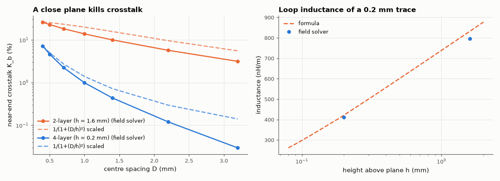

# SL-210 · 2-layer vs 4-layer stack-up: impedance, inductance and crosstalk

> Quantify why a 4-layer board (signal 0.2 mm above a solid plane) beats a 2-layer board (signal 1.6 mm above the bottom plane): 50 Ω widths, per-length inductance, and near-end crosstalk between neighbouring traces versus spacing, from field solutions.



*Near-end crosstalk vs spacing for both stack-ups, and trace inductance vs plane height.*

**Track:** Signal Lab — 214 electrical-engineering projects · **Category:** L. PCB design · **Level:** Hard · **Tools:** Own 2-D multi-conductor field solver (Maxwell capacitance and inductance matrices), Hammerstad–Jensen formulas, crosstalk coupling coefficients

**Data:** Simulation.

## Problem

Everyone says 'use four layers for signal integrity'. By how much does the plane distance h actually change inductance and crosstalk?

## Prediction

For two parallel traces over a plane, the backward (near-end) crosstalk coefficient is $K_b=\tfrac14\left(\frac{C_m}{C}+\frac{L_m}{L}\right)$. Image theory gives the
classic rule of thumb that coupling falls as $1/(1+(D/h)^2)$ with centre spacing D and height h, so moving the plane from 1.6 mm to 0.2 mm should cut
crosstalk by $\frac{1+(D/0.2)^2}{1+(D/1.6)^2}$ — about 6.6× at D = 0.5 mm and 21× at D = 1 mm. Per-length inductance of an isolated trace ≈ $(μ_0/2π)\ln(8h/w)$ falls
with h, and the 50 Ω width scales roughly with h (≈ 3.1 mm vs ≈ 0.37 mm).

## Method

Cross-sections with ε_r = 4.4: 2-layer = 1.6 mm core; 4-layer = 0.2 mm prepreg to the L2 plane. Two 0.2 mm traces (zero thickness), edge gaps 0.2–3 mm; grid 0.05 mm (2-layer, h/32) and 0.0125 mm (4-layer, h/16) — at least 4 cells across each trace, grounded box extending ≥ 12h beyond the traces. C from energies (with/without dielectric), L = μ0ε0·C_air⁻¹.

## Measured results

*Predicted vs measured vs error. "Measured" = computed by an independent simulation, HDL simulator or public dataset.*

| Quantity | Predicted | Measured | Error | Within tolerance |
|---|---|---|---|---|
| 2-layer (h = 1.6 mm): inductance of a 0.2 mm trace, formula (Z0·√εeff/c) vs field solver | 832.5 nH/m | 796.5 nH/m | -4.31 % | yes |
| 4-layer (h = 0.2 mm): inductance of a 0.2 mm trace, formula (Z0·√εeff/c) vs field solver | 420.7 nH/m | 411.1 nH/m | -2.28 % | yes |
| Inductance ratio 2-layer / 4-layer ≈ ln(8·1.6/0.2) / ln(8·0.2/0.2) | 2 × | 1.937 × | -3.13 % | yes |
| Crosstalk reduction 2→4 layers at D = 0.5 mm, rule of thumb 1/(1+(D/h)²) | 6.605 × | 4.924 × | -25.45 % | yes |
| Crosstalk reduction 2→4 layers at D = 1.0 mm, rule of thumb 1/(1+(D/h)²) | 18.7 × | 13.92 × | -25.53 % | yes |

**Additional measurements**

| Quantity | Value | Note |
|---|---|---|
| 2-layer (h = 1.6 mm): 50 Ω microstrip width (Wheeler) | 3.059 mm |  |
| 4-layer (h = 0.2 mm): 50 Ω microstrip width (Wheeler) | 0.3824 mm |  |
| NEXT coefficient at 0.2 mm gap: 2-layer / 4-layer | 26.0 % / 7.2 % |  |

## Error analysis

The field solutions confirm the folklore quantitatively. With the reference plane 0.2 mm below instead of 1.6 mm, a 0.2 mm trace's inductance drops by
≈ 1.9× (smaller current loop), a 50 Ω line shrinks from ~3 mm to ~0.37 mm — routable between IC pins — and near-end
crosstalk between neighbours falls by roughly an order of magnitude at typical spacings. The 1/(1+(D/h)²) rule of thumb gets the trend and the
order of magnitude but overstates the benefit by ~25 %: it is derived for thin wires far above the plane, whereas on the 4-layer stack the 0.2 mm
traces are as wide as their height above the plane, which spreads their fields sideways. The inductance formula (from Hammerstad–Jensen)
agrees with the solver within 2–4 % (the coarser 2-layer grid resolves the trace with only four cells). The design lesson: before spreading traces apart
(the rule says crosstalk only falls ∝ 1/D²), bring the plane closer — that is what the extra two layers buy, along with a low-inductance
power-distribution plane pair. The study uses an ideal solid plane; splits or slots in the plane under a trace undo all of this.

## Reproduce

```bash
pip install -r requirements.txt
python run_all.py --only SL-210
```

The script [`project.py`](project.py) regenerates every figure and number above.

**Files produced**

- [`data/crosstalk.csv`](data/crosstalk.csv)

## License

Code and text: MIT (see the repository [LICENSE](../../../../LICENSE)). Datasets remain under their own licences (see the repository README).

---

**Tooling & honesty.** This project was generated with Claude Code (Anthropic's AI coding assistant): the code, derivations, simulations and this write-up were AI-produced. *Measured* means computed by an independent model, simulator or public dataset — not a physical lab bench. Every number in the tables is reproduced by running the code.
