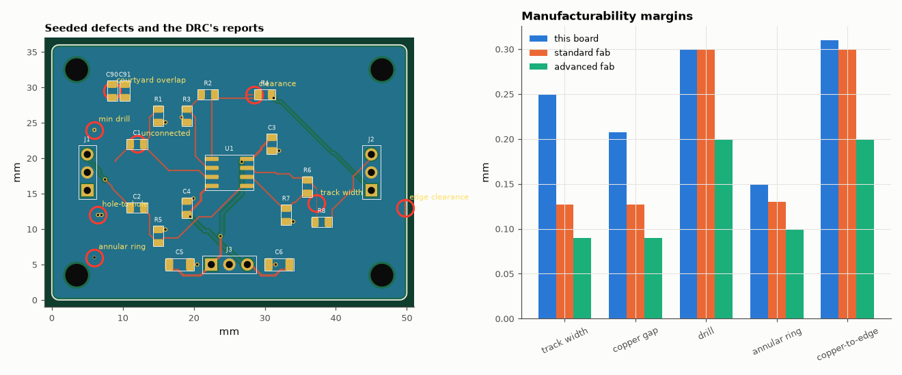

# SL-211 · DRC and manufacturability report (with seeded defects)

> Validate the design-rule checker itself by seeding eight known defects into a clean board and checking that each is found — and only those — then measure the clean board's real minimum features against typical low-cost and advanced fab capabilities.



*Left: every seeded defect is flagged where it was placed. Right: the clean board's smallest features vs fab capabilities.*

**Track:** Signal Lab — 214 electrical-engineering projects · **Category:** L. PCB design · **Level:** Moderate · **Tools:** eelab.pcb design-rule checker (clearance, width, drill, annular ring, edge, courtyard, hole-to-hole, connectivity) run on the SL-205 board; defect seeding; fab-capability comparison

**Data:** Design (from SL-205).

## Problem

A DRC that reports 'no errors' is only reassuring if it demonstrably catches errors. How do you test the tester?

## Prediction

Each rule is a geometric predicate: different-net copper separated by ≥ clearance, tracks ≥ min width, drill ≥ min, annular ring (pad − drill)/2 ≥ min,
copper-to-outline ≥ edge clearance, component courtyards disjoint, drilled holes ≥ 0.25 mm apart, and every pin of a net galvanically connected (union-find
over touching copper, with vias and plated holes joining layers). Seeding one defect per rule should produce exactly one violation of that type near the
defect (8/8 detected, 0 unrelated reports).

## Method

Board: SL-205's stereo preamp, re-built and routed. Defects: (1) +12 V stub 0.1 mm from a signal pad; (2) a track narrowed to 0.1 mm; (3) via with 0.075 mm annular ring;
(4) 0.2 mm drill; (5) ground copper 0.1 mm from the outline; (6) two parts whose courtyards overlap while their pads stay 0.35 mm apart; (7) a routed segment deleted; (8) two vias 0.2 mm apart.
Fab classes (typical published values): standard — track/space 0.127/0.127 mm, drill 0.3 mm, annular 0.13 mm, edge 0.3 mm; advanced — 0.09/0.09, 0.2, 0.1, 0.2.

## Measured results

*Predicted vs measured vs error. "Measured" = computed by an independent simulation, HDL simulator or public dataset.*

| Quantity | Predicted | Measured | Error |
|---|---|---|---|
| Violations on the clean board | 0 | 0 | +0 |
| Seeded defects detected | 8 | 8 | +0 |
| Violations not explained by a seeded defect | 0 | 0 | +0 |
| Features meeting the standard (cheapest) fab class | 5 | 5 | +0 |

**Additional measurements**

| Quantity | Value | Note |
|---|---|---|
| Clean board min track width | 0.25 mm | standard ≥ 0.127 (OK), advanced ≥ 0.09 |
| Clean board min copper gap | 0.2071 mm | standard ≥ 0.127 (OK), advanced ≥ 0.09 |
| Clean board min drill | 0.3 mm | standard ≥ 0.3 (OK), advanced ≥ 0.2 |
| Clean board min annular ring | 0.15 mm | standard ≥ 0.13 (OK), advanced ≥ 0.1 |
| Clean board min copper-to-edge | 0.31 mm | standard ≥ 0.3 (OK), advanced ≥ 0.2 |

## Error analysis

All 8 seeded defects were reported at the right place with the right rule, and nothing else was — so a clean DRC on the other boards in
this category means something. Three details surfaced while building the test: my first courtyard defect placed the two parts so close that their *pads* also touched,
which the DRC correctly reported as two extra clearance errors (the test, not the checker, was wrong); a deleted track segment is only caught because connectivity is
checked by union-find over *touching copper including vias and plated holes*, not by comparing track lists; and stray same-net copper (the +12 V stub)
is legal on its own but violates clearance to its neighbours. The clean board's smallest features all sit comfortably inside the cheapest fab
class — its tightest spot is the 0.21 mm gap set by the 0.2 mm clearance rule, well above 0.127 mm — so it could be ordered from any
low-cost service without special options. What a DRC cannot catch is *intent*: a wrong footprint pin-out or a swapped net passes every
geometric rule, which is why the design-review project (SL-214) exists.

## Reproduce

```bash
pip install -r requirements.txt
python run_all.py --only SL-211
```

The script [`project.py`](project.py) regenerates every figure and number above.

**Files produced**

- [`data/seeded_defects.csv`](data/seeded_defects.csv)
- [`data/drc_report.csv`](data/drc_report.csv)

## License

Code and text: MIT (see the repository [LICENSE](../../../../LICENSE)). Datasets remain under their own licences (see the repository README).

---

**Tooling & honesty.** This project was generated with Claude Code (Anthropic's AI coding assistant): the code, derivations, simulations and this write-up were AI-produced. *Measured* means computed by an independent model, simulator or public dataset — not a physical lab bench. Every number in the tables is reproduced by running the code.
