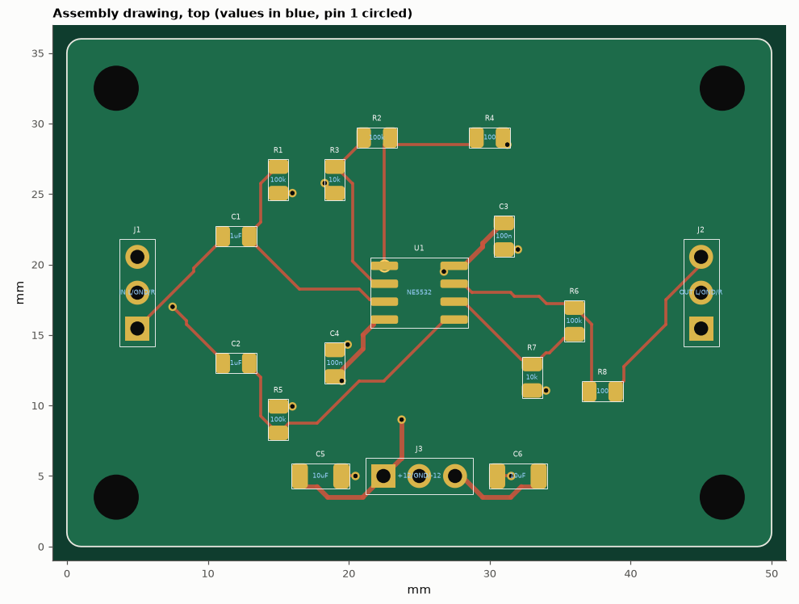

# SL-212 · BOM, pick-and-place and assembly documentation package

> Produce the documents an assembly house needs for the SL-205 preamp — grouped BOM, pick-and-place file, assembly drawing with pin-1 marks, fabrication notes — and verify them against each other: every placement's centroid is checked against the solder-paste openings in the Gerber.



*Assembly drawing generated from the same data as the BOM and CPL files.*

**Track:** Signal Lab — 214 electrical-engineering projects · **Category:** L. PCB design · **Level:** Moderate · **Tools:** eelab.pcb exporters (grouped BOM, centroid/CPL file, Gerber paste layer), gerbonara to re-read the paste layer, matplotlib assembly drawings

**Data:** Design (from SL-205).

## Problem

Assembly errors come from documents that disagree with each other (a rotated centroid, a BOM line that doesn't match the board). Can the package check itself?

## Prediction

For a symmetric footprint the placement centroid must coincide with the centroid of its paste openings; for a rotation error of θ the pads of a two-terminal part would
be displaced by half the pad pitch. BOM quantities must sum to the number of placed parts; the paste layer must contain exactly the SMD pads (THT pads get no
paste); every THT part must be listed for hand/wave soldering. I expect all cross-checks to agree exactly (0 mm deviation, 0 missing lines).

## Method

Board rebuilt from SL-205's design. Paste Gerber re-read with gerbonara; openings grouped by nearest SMD placement; centroid of each group vs CPL (x, y); rotation checked by comparing the
opening layout with the footprint rotated by the CPL angle.

## Measured results

*Predicted vs measured vs error. "Measured" = computed by an independent simulation, HDL simulator or public dataset.*

| Quantity | Predicted | Measured | Error | Within tolerance |
|---|---|---|---|---|
| BOM quantities sum to the number of placed parts | 18 | 18 | +0 |  |
| Pick-and-place rows = placed parts | 18 | 18 | +0 |  |
| Paste openings in the Gerber = SMD pads (THT pads get none) | 36 | 36 | +0 |  |
| Max |CPL centroid − paste-opening centroid| over SMD parts | 0 mm | 3.5527e-15 mm | +3.5527e-15 mm | yes |
| SMD parts whose paste openings match the CPL rotation | 15 | 15 | +0 |  |

**Additional measurements**

| Quantity | Value | Note |
|---|---|---|
| THT parts for hand/selective soldering | J1, J2, J3 |  |
| BOM lines / unique values | 10 / 10 |  |

## Error analysis

Because the BOM, the pick-and-place file, the Gerbers and the drawing are all generated from one board model, they agree — and the checks prove it
rather than assume it: quantities add up, every SMD part's centroid sits exactly on the centre of its own paste openings, and the openings match
the stated rotation. The paste layer correctly omits the 3 through-hole parts. Two things a real assembly house would still ask for that
this package cannot supply honestly: manufacturer part numbers with stock/lifecycle status (this BOM gives values and footprints only; no
prices are invented), and a confirmation of each part's rotation convention against their machine library — the zero-rotation orientation
of a footprint is a convention that differs between CAD tools, which is the most common real-world pick-and-place error.

## Reproduce

```bash
pip install -r requirements.txt
python run_all.py --only SL-212
```

The script [`project.py`](project.py) regenerates every figure and number above.

**Files produced**

- [`fab/preamp-F_Cu.gbr`](fab/preamp-F_Cu.gbr) — Gerber/drill (same board as SL-205)
- [`fab/preamp-F_Mask.gbr`](fab/preamp-F_Mask.gbr) — Gerber/drill (same board as SL-205)
- [`fab/preamp-F_Paste.gbr`](fab/preamp-F_Paste.gbr) — Gerber/drill (same board as SL-205)
- [`fab/preamp-F_Silk.gbr`](fab/preamp-F_Silk.gbr) — Gerber/drill (same board as SL-205)
- [`fab/preamp-B_Cu.gbr`](fab/preamp-B_Cu.gbr) — Gerber/drill (same board as SL-205)
- [`fab/preamp-B_Mask.gbr`](fab/preamp-B_Mask.gbr) — Gerber/drill (same board as SL-205)
- [`fab/preamp-B_Paste.gbr`](fab/preamp-B_Paste.gbr) — Gerber/drill (same board as SL-205)
- [`fab/preamp-B_Silk.gbr`](fab/preamp-B_Silk.gbr) — Gerber/drill (same board as SL-205)
- [`fab/preamp-Edge_Cuts.gbr`](fab/preamp-Edge_Cuts.gbr) — Gerber/drill (same board as SL-205)
- [`fab/preamp.drl`](fab/preamp.drl) — Gerber/drill (same board as SL-205)
- [`docs/FAB_NOTES.md`](docs/FAB_NOTES.md) — fabrication & assembly notes
- [`data/bom.csv`](data/bom.csv)
- [`data/pick_and_place.csv`](data/pick_and_place.csv)

## License

Code and text: MIT (see the repository [LICENSE](../../../../LICENSE)). Datasets remain under their own licences (see the repository README).

---

**Tooling & honesty.** This project was generated with Claude Code (Anthropic's AI coding assistant): the code, derivations, simulations and this write-up were AI-produced. *Measured* means computed by an independent model, simulator or public dataset — not a physical lab bench. Every number in the tables is reproduced by running the code.
