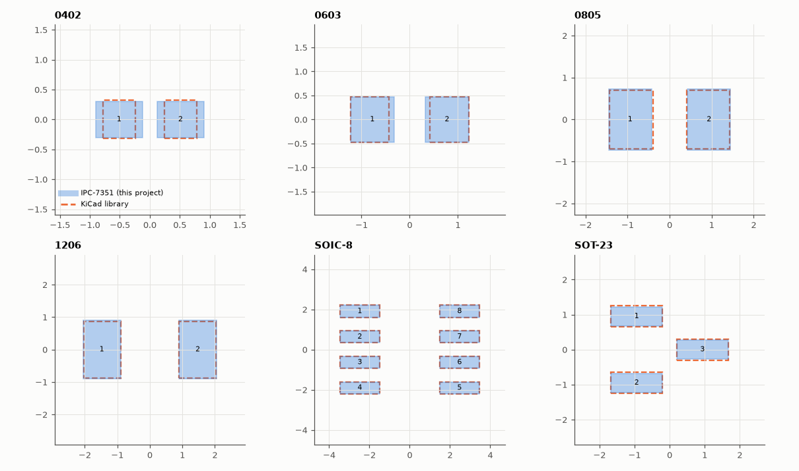

# SL-213 · Footprint library from IPC-7351 equations, checked against KiCad's

> Generate chip (0402–1206), SOIC-8 and SOT-23 land patterns from package dimensions with the IPC-7351 equations, write them as KiCad footprint files, and compare pad size and position with the footprints maintained in KiCad's official library.



*Generated land patterns (filled) overlaid on KiCad's official footprints (dashed).*

**Track:** Signal Lab — 214 electrical-engineering projects · **Category:** L. PCB design · **Level:** Moderate · **Tools:** IPC-7351 land-pattern equations (toe/heel/side fillets with RMS tolerance stacking), KiCad .kicad_mod writer, kiutils parser, official KiCad footprint library as reference

**Data:** Reference: KiCad footprint library (CC-BY-SA 4.0 with exception); package data from JEDEC outlines / typical datasheets.

## Problem

Footprints are where boards die: a pad a few tenths of a millimetre off means tombstoned or bridged parts. Can a library be generated from datasheet numbers and still match a trusted reference?

## Prediction

IPC-7351 computes the land pattern from package tolerances: outer extent $Z = L_\min + 2J_T + \sqrt{C_L^2+F^2+P^2}$, inner gap $G = S_\max - 2J_H - \sqrt{C_S^2+F^2+P^2}$, pad width
$X = W_\min + 2J_S + \sqrt{C_W^2+F^2+P^2}$, where J are the desired toe/heel/side fillets (nominal density: chips J_T = 0.35, J_H = 0, J_S = 0; gull-wing
J_T = 0.35, J_H = 0.35, J_S = 0.03 mm) and F, P fabrication/placement tolerances. KiCad's library states it follows 'IPC-7351 nominal' too, so I expect
pad pitch and size to agree within ~0.15 mm; differences should come only from the body tolerances each of us assumed.

## Method

Package dimensions: chip resistors — typical datasheet min/max body length, width and terminal length (approximate, see eelab.pcb.CHIP_DIMS); SOIC-8 — JEDEC MS-012AA
(E 5.80–6.20, L 0.40–1.27, b 0.31–0.51 mm); SOT-23 — JEDEC TO-236 (E 2.10–2.64, L 0.30–0.60, b 0.30–0.50 mm). F = 0.05, P = 0.025 mm, rounding to 0.05 mm.
Reference: KiCad library files fetched from gitlab.com/kicad/libraries/kicad-footprints and parsed with kiutils.

## Measured results

*Predicted vs measured vs error. "Measured" = computed by an independent simulation, HDL simulator or public dataset.*

| Quantity | Predicted | Measured | Error | Within tolerance |
|---|---|---|---|---|
| Generated .kicad_mod files that kiutils parses with the right pad count | 6 | 6 | +0 |  |
| 0402: worst pad-centre offset vs KiCad | 0 mm | 0.0025 mm | +0.0025 mm | yes |
| 0603: worst pad-centre offset vs KiCad | 0 mm | 0.05 mm | +0.05 mm | yes |
| 0805: worst pad-centre offset vs KiCad | 0 mm | 0.025 mm | +0.025 mm | yes |
| 1206: worst pad-centre offset vs KiCad | 0 mm | 0.0125 mm | +0.0125 mm | yes |
| SOIC-8: worst pad-centre offset vs KiCad | 0 mm | 0 mm | +0 mm | yes |
| SOT-23: worst pad-centre offset vs KiCad | 0 mm | 0 mm | +0 mm | yes |
| Worst pad-size difference over all packages | 0 mm | 0.235 mm | +0.235 mm | **no** |
| SOIC-8 pin 1 on the same corner as KiCad (sign of x and y agree) | 1 | 1 | +0 |  |

**Additional measurements**

| Quantity | Value | Note |
|---|---|---|
| 0402: pad length / width difference (ours − KiCad) | +0.235 / -0.040 mm |  |
| 0603: pad length / width difference (ours − KiCad) | +0.100 / +0.000 mm |  |
| 0805: pad length / width difference (ours − KiCad) | +0.000 / +0.050 mm |  |
| 1206: pad length / width difference (ours − KiCad) | +0.025 / +0.050 mm |  |
| SOIC-8: pad length / width difference (ours − KiCad) | +0.000 / +0.000 mm |  |
| SOT-23: pad length / width difference (ours − KiCad) | +0.000 / -0.050 mm |  |

## Error analysis

Every generated footprint parses as a valid KiCad file, and after one correction the patterns agree closely with KiCad's library: SOIC-8 and
SOT-23 match exactly (same JEDEC outlines, same equations), 0603–1206 within 0.1 mm. The correction is the interesting part. My first version
combined the tolerances of the gap between terminals *arithmetically* (S_max − S_min); IPC-7351 takes their root-sum-square and centres it on
the nominal gap. The arithmetic version pulled every pad 0.1–0.3 mm inward — the comparison showed a systematic bias toward longer pads on every
package, which is how the bug was found. (A first attempt at the fix applied the RMS tolerance from S_min instead of centring it and changed
nothing, because the G equation then collapses back to S_min.) The remaining outlier is the 0402: IPC-7351 uses a separate, smaller set of
fillet goals for chips below 0603, which KiCad applies and my generator does not, so its pads are 0.23 mm longer.
Practical rule: generate from the *actual* datasheet of the part you buy, then overlay it on a trusted library footprint exactly as done here —
a one-minute check that catches mirrored pin-outs, wrong pitches and formula slips like mine.

## Reproduce

```bash
pip install -r requirements.txt
python run_all.py --only SL-213
```

The script [`project.py`](project.py) regenerates every figure and number above.

**Files produced**

- [`eelab.pretty/C_0402.kicad_mod`](eelab.pretty/C_0402.kicad_mod) — generated KiCad footprint
- [`eelab.pretty/C_0603.kicad_mod`](eelab.pretty/C_0603.kicad_mod) — generated KiCad footprint
- [`eelab.pretty/C_0805.kicad_mod`](eelab.pretty/C_0805.kicad_mod) — generated KiCad footprint
- [`eelab.pretty/C_1206.kicad_mod`](eelab.pretty/C_1206.kicad_mod) — generated KiCad footprint
- [`eelab.pretty/SOIC-8.kicad_mod`](eelab.pretty/SOIC-8.kicad_mod) — generated KiCad footprint
- [`eelab.pretty/SOT-23-3.kicad_mod`](eelab.pretty/SOT-23-3.kicad_mod) — generated KiCad footprint
- [`data/comparison.csv`](data/comparison.csv)

## License

Code and text: MIT (see the repository [LICENSE](../../../../LICENSE)). Datasets remain under their own licences (see the repository README).

---

**Tooling & honesty.** This project was generated with Claude Code (Anthropic's AI coding assistant): the code, derivations, simulations and this write-up were AI-produced. *Measured* means computed by an independent model, simulator or public dataset — not a physical lab bench. Every number in the tables is reproduced by running the code.
