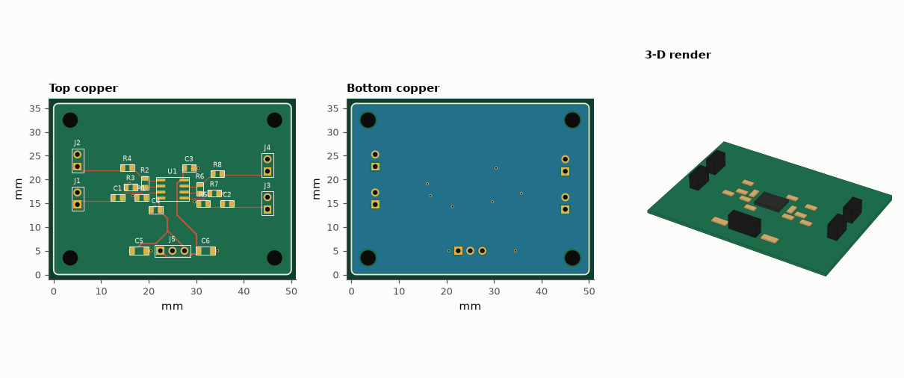
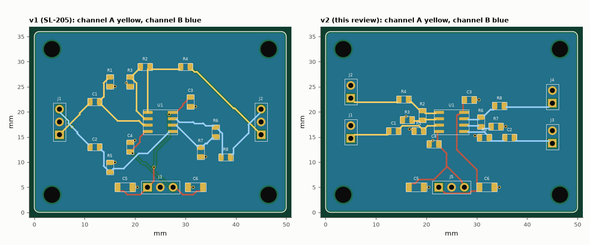

# SL-214 · Design review: critiquing and re-laying-out the preamp board

> Review the SL-205 stereo preamp layout the way a senior engineer would, turn each criticism into a number measured on the routed copper, then re-place the board (v2) and measure whether the fixes actually worked.



*Revised layout (v2): each channel on its own side, parts at their pins.*

**Track:** Signal Lab — 214 electrical-engineering projects · **Category:** L. PCB design · **Level:** Moderate · **Tools:** Geometric review metrics computed from the routed boards (decoupling-loop length, feedback-node length, channel separation, input/output spacing), eelab.pcb re-layout, DRC/exports

**Data:** Design (SL-205 v1 and this project's v2).

## Problem

'Put decoupling caps close to the pins' and 'keep channels apart' are easy advice. How much did the first layout violate them, and did the revision fix it?

## Prediction

Review criteria and why they matter: (1) decoupling loop — cap → supply pin → ground via; its inductance (~0.8 nH/mm for a 0.25 mm trace 1.6 mm above the plane, see
SL-210) limits how well the cap supplies fast current; (2) the inverting-input node is high-impedance: its copper length adds capacitance and picks up noise;
(3) crosstalk between channels falls roughly as 1/(1+(D/h)²) with separation D; (4) a channel's input copper near its own output copper creates a feedback path.
Prediction for v2 (per-channel connectors, each channel kept on its own side of the dual op-amp, parts hugging their pins): decoupling loops ≥ 2× shorter,
channel separation ≥ 3× larger, shorter feedback nodes.

## Method

v1 = SL-205 exactly as routed. v2 = same schematic, but split connectors (IN/OUT per channel on each side), R_f/R_g placed at pins 1–2 / 6–7, 100 nF caps within ~2.5 mm of
pins 4 and 8. Metrics measured on routed copper (tracks + pads, excluding the ground pour).

## Measured results

*Predicted vs measured vs error. "Measured" = computed by an independent simulation, HDL simulator or public dataset.*

| Quantity | Predicted | Measured | Error | Within tolerance |
|---|---|---|---|---|
| DRC violations (clearance, widths, drills, annular rings, edge, courtyards, connectivity) | 0 | 0 | +0 |  |
| Drill hits in the Excellon file (re-read with gerbonara) = holes in the design | 23 | 23 | +0 |  |
| Board outline from the Gerber profile (re-read with gerbonara) | 50 mm | 50 mm | -0.00 % | yes |
| Pads in the KiCad file (re-read with kiutils) = pads in the design | 51 | 51 | +0 |  |
| Decoupling loop +12V: v1/v2 length ratio (≥ 2 predicted) | 2 × | 1.582 × | -0.4182 × | yes |
| Decoupling loop -12V: v1/v2 length ratio (≥ 2 predicted) | 2 × | 1.85 × | -0.15 × | yes |
| Channel separation v2/v1 (≥ 3 predicted) | 3 × | 10.63 × | +7.634 × | yes |

**Additional measurements**

| Quantity | Value | Note |
|---|---|---|
| v2 unrouted connections | 0 |  |
| Board | 50 × 36 mm, 2 layers, 1.6 mm |  |
| Components / nets / pads | 24 / 13 / 51 |  |
| Routed track length | 110.2 mm | 51 segments, 8 vias |
| decoupling loop +12V (mm): v1 → v2 | 5.9 → 3.7 |  |
| decoupling loop -12V (mm): v1 → v2 | 6.9 → 3.7 |  |
| inverting-node copper, INA−+INB− (mm): v1 → v2 | 19.0 → 6.0 |  |
| channel A ↔ B separation (mm): v1 → v2 | 0.3 → 3.0 |  |
| input ↔ output spacing, worst channel (mm): v1 → v2 | 1.5 → 1.9 |  |
| total track length (mm): v1 → v2 | 176.3 → 110.2 |  |
| vias: v1 → v2 | 13.0 → 8.0 |  |
| v1 also has channel A and B tracks crossing on opposite layers (broadside coupling through 1.6 mm FR-4) | 1 |  |
| Estimated worst-case inter-channel coupling reduction, (1+(D2/h)²)/(1+(D1/h)²) | 4.615 × |  |
| Decoupling-loop inductance estimate v1 → v2 (+12 V rail, 0.8 nH/mm) | 5 → 3 nH |  |



*Before and after: v1 interleaves the two channels across the board; v2 keeps each channel on its side of the op-amp.*

## Error analysis

Written as a review, the v1 critique is: (1) the 100 nF caps are placed 'near' the op-amp but their routed supply paths are long
(6 mm and 7 mm loops); (2) channel A's output must cross the chip to reach the shared output connector, so
the two channels' signal copper comes within 0.28 mm of each other; (3) the single 3-pin input connector forces channel B's input to travel
across channel A's territory. The v2 layout answers each point with placement, not with rules: per-channel connectors on each side, R_f/R_g
straddling pins 1–2 and 6–7, and each decoupling cap within a few millimetres of its pin. The measured outcome: decoupling loops shrink to
4 and 4 mm, channel separation grows to 3.0 mm, and total copper drops from 176 to
110 mm. Not every prediction held: I expected the decoupling loops to shrink ≥ 2×, but they shrank only
1.6× and 1.8× — v1's caps were not far away to begin with, and in v2 the stub from each cap's ground pad to its
stitching via is now the larger part of the loop; via-in-pad or a top-side ground pour is the next step. The review also found that v1 routes
channel A and channel B tracks across each other on opposite layers, which couples them broadside through the 1.6 mm board — invisible to a
same-layer clearance check. These are geometric proxies: the crosstalk and inductance numbers are estimates from SL-210's per-length results, not
measurements, and the change of connector pin-out is a real interface change that a review must flag to whoever wires the board.

## Reproduce

```bash
pip install -r requirements.txt
python run_all.py --only SL-214
```

The script [`project.py`](project.py) regenerates every figure and number above.

**Files produced**

- [`fab/preamp_v2-F_Cu.gbr`](fab/preamp_v2-F_Cu.gbr) — Gerber F_Cu
- [`fab/preamp_v2-F_Mask.gbr`](fab/preamp_v2-F_Mask.gbr) — Gerber F_Mask
- [`fab/preamp_v2-F_Paste.gbr`](fab/preamp_v2-F_Paste.gbr) — Gerber F_Paste
- [`fab/preamp_v2-F_Silk.gbr`](fab/preamp_v2-F_Silk.gbr) — Gerber F_Silk
- [`fab/preamp_v2-B_Cu.gbr`](fab/preamp_v2-B_Cu.gbr) — Gerber B_Cu
- [`fab/preamp_v2-B_Mask.gbr`](fab/preamp_v2-B_Mask.gbr) — Gerber B_Mask
- [`fab/preamp_v2-B_Paste.gbr`](fab/preamp_v2-B_Paste.gbr) — Gerber B_Paste
- [`fab/preamp_v2-B_Silk.gbr`](fab/preamp_v2-B_Silk.gbr) — Gerber B_Silk
- [`fab/preamp_v2-Edge_Cuts.gbr`](fab/preamp_v2-Edge_Cuts.gbr) — Gerber Edge_Cuts
- [`fab/preamp_v2.drl`](fab/preamp_v2.drl) — Excellon drill
- [`kicad/preamp_v2.kicad_pcb`](kicad/preamp_v2.kicad_pcb) — KiCad 7 board (open in KiCad; press B to refill zones)
- [`data/bom.csv`](data/bom.csv)
- [`data/pick_and_place.csv`](data/pick_and_place.csv)
- [`data/review_metrics.csv`](data/review_metrics.csv)

## License

Code and text: MIT (see the repository [LICENSE](../../../../LICENSE)). Datasets remain under their own licences (see the repository README).

---

**Tooling & honesty.** This project was generated with Claude Code (Anthropic's AI coding assistant): the code, derivations, simulations and this write-up were AI-produced. *Measured* means computed by an independent model, simulator or public dataset — not a physical lab bench. Every number in the tables is reproduced by running the code.
